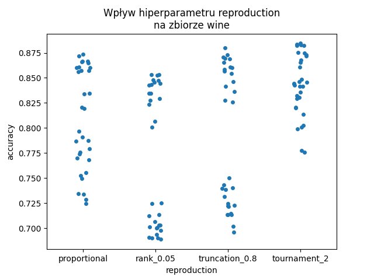
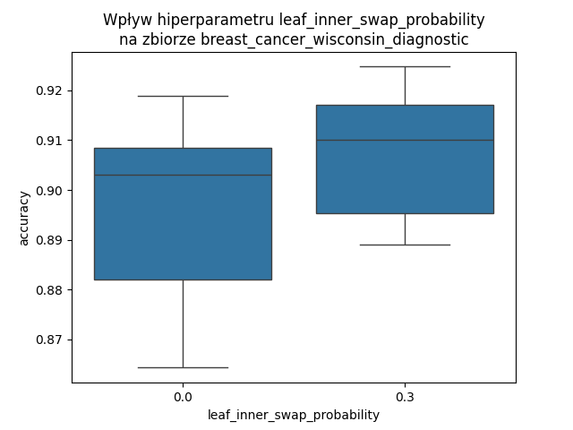
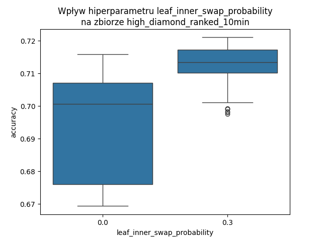
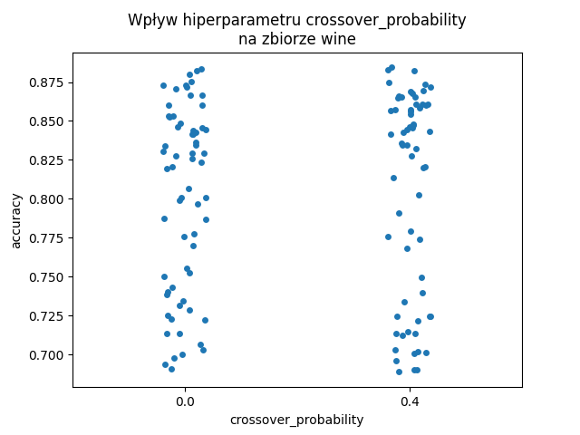
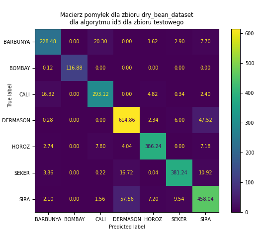

# UMA Projekt – Ewolucja drzewa
## Dokumentacja końcowa
Skład zespołu:\
Jakub Proboszcz 318713\
Paweł Kochański 318673

### 1. Temat projektu
„Ewolucja drzewa\
Tworzenie drzewa decyzyjnego przy pomocy algorytmu ewolucyjnego. Zwykle klasyfikatory budowane są w oparciu o metodę zachłanną - w kolejnym kroku wybieramy lokalnie najlepszy podział. Takie podejście jest bardzo szybkie jednak nie zawsze prowadzi do utworzenia optymalnej struktury drzewa.”

### 2. Ustalenia z dokumentacji wstępnej i konsultacji

#### Doprecyzowanie tematu\
Zaimplementowanie algorytmu tworzącego na podstawie danych wejściowych drzewo decyzyjne z użyciem metod typowych dla algorytmu ewolucyjnego. Algorytm ewolucyjny umożliwia eksplorację różnych konfiguracji, dążąc do znalezienia bardziej globalnie optymalnego drzewa decyzyjnego, w odróżnieniu od zachłannych metod stosowanych w zwykłych klasyfikatorach. Zbadanie efektywności powstałych drzew i porównanie ich z istniejącą implementacją algorytmu ID3.


#### Wybrany wariant drzewa decyzyjnego\
W używanym przez nas wariancie drzewa decyzyjnego każdemu węzłowi niebędącemu liściem przypisany jest **atrybut** $a(x)$ i **wartość graniczna** $A$. Każdy taki węzeł ma 2 dzieci - lewe jest wybierane, jeżeli (dla obecnie rozważanego przykładu $\bar{x}$) spełniony jest warunek $a(\bar{x})<A$, a prawe w przeciwnym przypadku ($a(\bar{x})\ge A$).

Każdemu liściowi przyporządkowana jest **klasa**, przydzielana przykładom które do tego liścia trafią.

Z takich drzew składa się populacja w zaimplementowanym przez nas algorytmie ewolucyjnym.


#### Inicjalizacja populacji\
Każdy węzeł każdego drzewa w populacji startowej jest generowany następująco:\
Jeżeli osiągnięto maksymalną głębokość drzewa lub z prawdopodobieństwem ```leaf_probability(depth)``` węzeł będzie liściem.\
Jeżeli węzeł jest liściem, przypisywana jest mu klasa odpowiadająca klasie większościowej (najliczniejsza) z części zbioru danych, która trafia do tego liścia.\
Jeżeli w tym podzbiorze jest kilka równolicznych najliczniejszych klas, wybierana jest losowa z nich.\
Jeżeli do tego liścia nie trafia ani jeden przykład ze zbioru danych, klasa jest losowana.\
Jeżeli węzeł nie jest liściem, losowany jest atrybut, według którego następuje podział. Następnie, granica podziału jest losowana z dziedziny tego atrybutu. Dzieci tego węzła są generowane rekurencyjnie; zbiór danych otrzymany przez ten węzeł jest dzielony według wylosowanego atrybutu i granicy podziału i podzbiory są przekazywane dzieciom.\
Jeżeli zdarzy się sytuacja, że oboje dzieci danego węzła to liście z tą samą klasą, klasa prawego dziecka jest zmieniana na inną, losową.

W dokumentacji wstępnej klasa liścia miała być losowa, a nie większościowa - zostało to zmienione zgodnie z uwagą z maila.


#### Reprodukcja\
Wykonaliśmy eksperymenty z użyciem 4 wariantów reprodukcji: proporcjonalnej, rangowej, progowej i turniejowej. W naszym algorytmie ewolucji drzewa działają one tak samo, jak w zwykłym algorytmie ewolucyjnym.


#### Mutacja\
Mutacja polega na wylosowaniu jednego spośród węzłów drzewa. Z prawdopodobieństwem ```leaf_inner_swap_probability``` jest on zamieniany z liścia na węzeł wewnętrzny lub odwrotnie.\
Przy zmianie z liścia na węzeł wewnętrzny, atrybut, granica podziału i dzieci są generowane tak, jak w przypadku inicjalizacji, z tym, że dzieci zawsze będą liśćmi.\
Przy zmianie z węzła wewnętrznego na liść, klasa nowego liścia jest ustalana na losową spośród najliczniejszych klas wśród liści poddrzewa, którego korzeniem jest mutowany węzeł. Poddrzewo to jest odrzucane.\
Jeżeli nie zachodzi taka zamiana i węzeł jest liściem, to jego klasa jest zmieniana na losową inną. Jeżeli jest ona taka sama, jak klasa drugiego liścia z tym samym rodzicem, to rodzic jest zamieniany w liść z klasą taką, jaką miały jego dzieci.\
Jeżeli nie zachodzi taka zamiana i węzeł jest węzłem wewnętrznym, to jego atrybut jest zmieniany na losowy, a granica podziału jest ponownie losowana z dziedziny nowo wylosowanego atrybutu.

W dokumentacji wstępnej nie było zamiany węzła wewnętrznego w liść - zostało to zmienione zgodnie z uwagą z maila.


#### Krzyżowanie\
Krzyżowanie polega na wyborze dwóch węzłów w obu krzyżowanych drzewach oraz zamianie ich miejscami, razem z ich poddrzewami.\
Jeżeli jedno z drzew potomnych ma głębokość większą niż parametr ```max_depth```, to zamiast niego jest zwracany jeden z rodziców.\
Jeżeli w drzewie potomnym wystąpi sytuacja, gdzie dwa liście ze wspólnym rodzicem mają taką samą klasę, to rodzic jest zastępowany przez liść z klasą, którą miały jego dzieci (analogicznie jak w mutacji).


#### Sukcesja\
Wykonywaliśmy eksperymenty z użyciem 2 wariantów sukcesji: generacyjnej i elitarnej. W naszym algorytmie ewolucji drzewa działają one tak samo, jak w zwykłym algorytmie ewolucyjnym.


#### Funkcja oceny\
Funkcją oceny używaną przez nas jest dokładność (*accuracy*), czyli iloraz liczby przykładów ze zbioru treningowego, któremu dane drzewo przydzieliło właściwą klasę oraz liczby wszystkich przykładów w zbiorze treningowym. Funkcja ta jest **maksymalizowana**.


#### Wybrane zbiory danych\
Wybraliśmy pięć zbiorów danych:

               nazwa zbioru danych  liczba atrybutów   liczba klas   liczba przykładów
---------------------------------- ------------------ ------------- -------------------
       glass_identification               9              6             214
         dry_bean_dataset                 16             7            13611
breast_cancer_wisconsin_diagnostic        30             2             569
               wine                       13             3             178
    high_diamond_ranked_10min             38             2            9879


Hiperłącza do nich oraz liczności ich klas są wymienione poniżej.

Zbiór danych glass_identification [[link]](http://archive.ics.uci.edu/dataset/42/glass+identification):

Przewidywanie rodzaju szkła na podstawie jego własności fizykochemicznych.

 nazwa klasy liczba wystąpień
------------ ----------------
     1             70
     2             76
     3             17
     5             13
     6             9
     7             29

Zbiór danych dry_bean_dataset [[link]](http://archive.ics.uci.edu/dataset/602/dry+bean+dataset):

Przewidywanie gatunku suszonej fasoli na podstawie cech zdjęcia pojedynczej fasolki.

 nazwa klasy liczba wystąpień
------------ ----------------
 BARBUNYA         1322
  BOMBAY          522
   CALI           1630
 DERMASON         3546
   HOROZ          1928
   SEKER          2027
   SIRA           2636

   Zbiór danych breast_cancer_wisconsin_diagnostic [[link]](http://archive.ics.uci.edu/dataset/17/breast+cancer+wisconsin+diagnostic):

Diagnoza rodzaju raka piersi na podstawie właściwości komórek pobranych z piersi.

 nazwa klasy liczba wystąpień
------------ ----------------
     B            357
     M            212

Zbiór danych wine [[link]](http://archive.ics.uci.edu/dataset/109/wine):

Przewidywanie rodzaju wina na podstawie jego cech fizykochemicznych.

 nazwa klasy liczba wystąpień
------------ ----------------
     1             59
     2             71
     3             48

Zbiór danych high_diamond_ranked_10min [[link]](https://www.kaggle.com/datasets/bobbyscience/league-of-legends-diamond-ranked-games-10-min):

Przyporządkowanie wyników (zwycięstwo/porażka) meczy rankingowych w grze „League of Legends" na podstawie statystyk meczu pobranych w jego dziesiątej minucie trwania.

 nazwa klasy liczba wystąpień
------------ ----------------
     0            4949
     1            4930


#### Metoda referencyjna\
Wyniki uzyskane przez nasz algorytm porównujemy z wynikami istniejącej implementacji algorytmu ID3:\
[ID3 - hiperłącze](https://pypi.org/project/decision-tree-id3/)


### 3. Poprawność implementacji

W celu weryfikacji poprawności implementacji algorytmu, przygotowaliśmy testy jednostkowe do jego części składowych niezawierających losowości. Są one zawarte w plikach test_tree.py oraz test_genetic_operations.py. Ponadto, sprawdziliśmy poprawność inicjalizacji drzewa oraz reprodukcji w pliku manual_testing.ipynb - dla inicjalizacji wypisujemy wygenerowane drzewo, a dla reprodukcji rysujemy histogram przybliżający, jak zostają wybrane osobniki w każdej z reprodukcji.

Poprawność całości implementacji algorytmu pokazuje porównanie z wynikami algorytmu ID3, zawarte w poniższej sekcji.


### 4. Eksperymenty

#### Przeszukiwanie po hipersiatce hiperparametrów\
Skrypt wykonujący poniższy eksperyment jest zawarty w pliku experiments_evotree.py. Dane z eksperymentów były agregowane i rysowane na wykresach skryptem aggregate_results.py. Dodatkowe eksperymenty z poniższej sekcji były wykonywane z pomocą skryptu single_experiment.py - hiperparametry były określane bezpośrednio w skrypcie.

Uruchomiliśmy nasz algorytm dla $128$ różnych kombinacji hiperparametrów. Liczba ta została ustalona na podstawie przewidywanego czasu obliczeń - obliczenia zajęły kilka dni. Sprawdzane były następujące wartości każdego z hiperparametrów:\
- ```max_depth``` - maksymalna głębokość drzewa w populacji - wartości $5$ oraz $20$;\
- ```reproduction``` - sprawdzane były reprodukcje: proporcjonalna, rangowa z parametrami $a=0{,}05$ i $k=0$, progowa z progiem $0{,}8$, turniejowa z rozmiarem turnieju $2$;\
- ```mutation_probability``` - prawdopodobieństwo zajścia mutacji dla każdego drzewa w populacji - wartości $0{,}4$ oraz $0{,}8$;\
- ```leaf_inner_swap_probability``` - prawdopodobieństwo zamiany liścia w węzeł wewnętrzny lub odwrotnie podczas mutacji - wartości $0$ oraz $0{,}3$;\
- ```crossover_probability``` - prawdopodobieństwo zajścia krzyżowania dla każdej pary drzew - wartości $0$ oraz $0{,}4$;\
- ```succession``` - sprawdzane były sukcesje: generacyjna oraz elitarna dla rozmiaru elity $2$.

Prawdopodobieństwo, że węzeł będzie liściem podczas inicjalizacji ustaliliśmy na $1-\left(\frac{1}{2}\right)^g$, gdzie $g$ to głębokość tego węzła (korzeń ma głębokość $0$).

Przyjęliśmy rozmiar populacji równy $20$ - czas działania algorytmu nie pozwolił na optymalizację tego hiperparametru.

Przyjęliśmy maksymalną liczbę iteracji równą $500$; obliczenia są również zatrzymywane gdy ocena najlepszego drzewa nie poprawi się w ciągu $50$ kolejnych iteracji. Warunek ten jest sprawdzany co $50$-tą iterację.

Eksperyment został wykonany dla wszystkich $5$ zbiorów danych. Z ich wszystkich został wydzielony zbiór testowy wielkości $0{,}2$ całego zbioru. Dla każdej kombinacji hiperparametrów wykonano $25$ uruchomień $5$-krotnej walidacji krzyżowej na zbiorze bez zbioru testowego, dla każdego zbioru danych. Na poniższych wykresach są przedstawione uśrednione dokładności na zbiorach walidacyjnych z tych $125$ uruchomień algorytmu.

#### Wpływ hiperparametru ```max_depth``` na działanie algorytmu\

{ width=370px } { width=370px }\
{ width=370px } { width=370px }\
{ width=370px } { width=370px }\
{ width=370px } { width=370px }\
{ width=370px } { width=370px }\

Jak widać na wykresach, wartość hiperparametru ```max_depth``` nie wpłynęła znacząco na wyniki algorytmu. Dla zbiorów danych ```glass_identification``` uzyskano nawet pojedyncze znacząco lepsze wartości dla ```max_depth = 5```. Oznacza to, że w ogólności lepsze są niższe wartości ```max_depth``` - skoro płytsze drzewa wystarczają, to nie ma sensu próbować konstruować głębszych, dla których operacje (w szczególności predykcja) są wolniejsze.

#### Wpływ hiperparametru ```reproduction``` na działanie algorytmu\

{ width=370px } { width=370px }\
{ width=370px } { width=370px }\
{ width=370px } { width=370px }\
{ width=370px } { width=370px }\
{ width=370px } { width=370px }\

Dla wszystkich zbiorów danych reprodukcja turniejowa (z rozmiarem turnieju $2$) okazała się być najlepsza. Jednakże, dla zbioru danych ```high_diamond_ranked_10min``` reprodukcja proporcjonalna okazała się być niemal równie dobra - najprawdopodobniej dla funkcji celu innych niż dokładność (sensowne drzewa mają dokładności z przedziału $0{,}5$-$0{,}8$, więc reprodukcja proporcjonalna może mieć problemy z rozróżnieniem lepszych drzew od średnio dobrych), lub dla innych zbiorów danych, mogłaby ona osiągnąć wyniki lepsze niż reprodukcja turniejowa.

#### Wpływ hiperparametru ```mutation_probability``` na działanie algorytmu\

{ width=370px } { width=370px }\
{ width=370px } { width=370px }\
{ width=370px } { width=370px }\
{ width=370px } { width=370px }\
{ width=370px } { width=370px }\

Wyższe prawdopodobieństwo mutacji pozwoliło, dla niektórych kombinacji hiperparametrów, osiągnąć lepsze wyniki. Jako jedyne źródło eksploracji algorytmu, częstsza mutacja daje większe prawdopodobieństwo trafienia na drzewa lepiej przybliżające funkcję celu. Jednakże, w przypadku obecności krzyżowania, silniejsza mutacja zwiększa zdolności eksploracyjne kosztem eksploatacji i mogą zdarzyć się sytuacje, gdzie okolica maksimum lokalnego nie zostanie wystarczająco dobrze sprawdzona. Zapewne dlatego dla silniejszej mutacji jest także więcej słabszych wyników (pierwszy kwartyl lub drugi kwartyl na wszystkich wykresach pudełkowych poza ```high_diamond_ranked_10min``` jest niżej dla wyższego prawdopodobieństwa mutacji).

Przeprowadziliśmy dodatkowe eksperymenty dla ```mutation_probability = 1,0```. Wyniki w poniższej tabeli to zagregowane dokładności z $25$-krotnie powtórzonej $5$-krotnej walidacji krzyżowej (używany był zbiór bez zbioru testowego) na różnych zbiorach danych, w formacie średnia ± odchylenie standardowe. Wartości pozostałych hiperparametrów były takie, jak dla najlepszej kombinacji hiperparametrów dla danego zbioru danych.

 p.mutacji \\ zbiór danych       cancer                 bean                   glass             wine                 games
--------------------------- -------------------- -------------------- -------------------- -------------------- --------------------
        $0{,}4$              $0{,}92\pm 0{,}02$   $0{,}68\pm 0{,}10$   $0{,}54\pm 0{,}10$   $0{,}88\pm 0{,}06$   $0{,}72\pm 0{,}01$
        $0{,}8$              $0{,}92\pm 0{,}02$   $0{,}73\pm 0{,}08$   **0,57±0,10**        $0{,}87\pm 0{,}06$   $0{,}72\pm 0{,}01$
        $1{,}0$              $0{,}92\pm 0{,}02$   **0,74±0,08**        $0{,}56\pm 0{,}10$   $0{,}88\pm 0{,}06$   $0{,}72\pm 0{,}01$

Jak widać, zwiększenie prawdopodobieństwa mutacji do maksymalnej wartości nie polepszyło znacząco wyników. Algorytm działa lepiej, jeżeli do etapu krzyżowania i sukcesji dojdą jakieś niezmutowane drzewa.

#### Wpływ hiperparametru ```leaf_inner_swap_probability``` na działanie algorytmu\

{ width=370px } { width=370px }\
{ width=370px } { width=370px }\
{ width=370px } { width=370px }\
{ width=370px } { width=370px }\
{ width=370px } { width=370px }\

Obecność zamiany liścia w węzeł wewnętrzny lub odwrotnie zdecydowanie poprawia wyniki algorytmu. Wyjątkiem jest najlepsza kombinacja hiperparametrów dla zbioru ```wine```, ale nawet na tym zbiorze wyniki dla większości innych kombinacji hiperparametrów są lepsze. Dla zbioru danych ```high_diamond_ranked_10min``` poprawa jest drastyczna. Mutacja bez takiej zamiany (poza przypadkiem powstania dwóch sąsiednich liści z tą samą klasą) nie zmienia struktury drzewa, a tylko parametry pojedynczego węzła. Jeżeli ```leaf_inner_swap_probability``` wynosi $0$, to eksplorację w dziedzinie struktury drzewa musi wykonywać krzyżowanie. Krzyżowanie jednak okazało się niewystarczające.

Przeprowadziliśmy dodatkowe eksperymenty dla ```leaf_inner_swap_probability = 0,6```. Wyniki w poniższej tabeli to zagregowane dokładności z $25$-krotnie powtórzonej $5$-krotnej walidacji krzyżowej (używany był zbiór bez zbioru testowego) na różnych zbiorach danych, w formacie średnia ± odchylenie standardowe. Wartości pozostałych hiperparametrów były takie, jak dla najlepszej kombinacji hiperparametrów dla danego zbioru danych.

 p.zamiany \\ zbiór danych     cancer                     bean               glass               wine                  games
--------------------------- -------------------- -------------------- -------------------- -------------------- --------------------
        $0{,}0$              $0{,}91\pm 0{,}03$   $0{,}61\pm 0{,}07$   $0{,}53\pm 0{,}09$   $0{,}88\pm 0{,}06$   $0{,}72\pm 0{,}02$
        $0{,}3$              $0{,}92\pm 0{,}02$   **0,73±0,08**        **0,57±0,10**        $0{,}88\pm 0{,}06$   $0{,}72\pm 0{,}01$
        $0{,}6$              $0{,}92\pm 0{,}02$   $0{,}72\pm 0{,}08$   $0{,}54\pm 0{,}10$   $0{,}87\pm 0{,}07$   $0{,}72\pm 0{,}01$

Jak widać, dalsze zwiększanie prawdopodobieństwa zamiany nie prowadzi do znaczącego polepszania wyniku.

#### Wpływ hiperparametru ```crossover_probability``` na działanie algorytmu\

{ width=370px } { width=370px }\
{ width=370px } { width=370px }\
{ width=370px } { width=370px }\
{ width=370px } { width=370px }\
{ width=370px } { width=370px }\

Obecność krzyżowania, dla wszystkich zbiorów danych poza ```high_diamond_ranked_10min```, polepszyła wyniki dla niektórych kombinacji hiperparametrów, a dla innych pogorszyła, co widać na wykresach pudełkowych jako oddalenie się od siebie pierwszego i trzeciego kwartylu. Wpływ krzyżowania przy najlepszych kombinacjach hiperparametrów jest niejasny - dla niektórych zbiorów danych krzyżowanie nieznacznie polepszyło wynik, dla innych nieznacznie pogorszyło.

Tak jak w poprzednich przypadkach, eksploatacja wydaje się być mniej ważna od eksploracji w tym eksperymencie - silniejsza mutacja ewidentnie poprawia wynik, a krzyżowanie - nie.

#### Wpływ hiperparametru ```succession``` na działanie algorytmu\

{ width=370px } { width=370px }\
{ width=370px } { width=370px }\
{ width=370px } { width=370px }\
{ width=370px } { width=370px }\
{ width=370px } { width=370px }\

Elitarna sukcesja zdecydowanie polepszyła wyniki algorytmu w stosunku do sukcesji generacyjnej. Wynika to z tego, że mutacja zmienia drzewa dość mocno - nawet mutacja bez zamiany liścia w węzeł wewnętrzny lub odwrotnie może bardzo popsuć jakość drzewa, np. zmieniając test w korzeniu. W związku z tym, zachowanie najlepszych osobników w populacji jest konieczne - możliwe, że dopiero po wielu iteracjach uzyskana zostanie poprawa, szybka strata dobrego osobnika uniemożliwi jakąkolwiek eksploatację jego okolic.

Przeprowadziliśmy dodatkowe eksperymenty dla rozmiaru elity równego $1$ oraz $3$. Wyniki w poniższej tabeli to zagregowane dokładności z $25$-krotnie powtórzonej $5$-krotnej walidacji krzyżowej (używany był zbiór bez zbioru testowego) na różnych zbiorach danych, w formacie średnia ± odchylenie standardowe. Wartości pozostałych hiperparametrów były takie, jak dla najlepszej kombinacji hiperparametrów dla danego zbioru danych.

 rozmiar elity \\ zbiór danych     cancer                     bean               glass                 wine                  games
------------------------------- -------------------- -------------------- -------------------- -------------------- --------------------
 $0$ (sukcesja generacyjna)      $0{,}91\pm 0{,}03$   $0{,}59\pm 0{,}07$   $0{,}49\pm 0{,}09$   $0{,}84\pm 0{,}10$   $0{,}71\pm 0{,}02$
        $1$                      $0{,}92\pm 0{,}03$   $0{,}69\pm 0{,}09$   $0{,}55\pm 0{,}11$   $0{,}87\pm 0{,}06$   $0{,}72\pm 0{,}01$
        $2$                      $0{,}92\pm 0{,}02$   $0{,}73\pm 0{,}08$   **0,57±0,10**        **0,88±0,06**        $0{,}72\pm 0{,}01$
        $3$                      $0{,}92\pm 0{,}02$   **0,75±0,07**        $0{,}56\pm 0{,}09$   $0{,}87\pm 0{,}06$   $0{,}72\pm 0{,}00$

Jak widać, wzrost rozmiaru elity nie zwiększa znacząco efektywności algorytmu. Znacząca poprawa jakości następuje tylko przy zmianie z sukcesji generacyjnej na elitarną z rozmiarem elity $1, z wyjątkiem zbiorów danych breast_cancer_wisconsin_diagnostic oraz high_diamond_ranked_10min. Są to jedyne zbiory dwuklasowe - możliwe, że dla zbiorów wieloklasowych mutacja częściej pogarsza niż poprawia drzewo i elita jest bardziej potrzebna.

#### Najlepsze zestawy hiperparametrów\
Wyniki w poniższej tabeli to dokładności na zbiorze walidacyjnym, zagregowane z 25-krotnie powtórzonej 5-krotnej walidacji krzyżowej, dla najlepszych (o najlepszej średniej dokładności) zestawów hiperparametrów dla każdego ze zbiorów danych.

 z.danych      max_depth      reprodukcja    p.mut.   p.zamiany   p.krzyż.   sukcesja   średnia      najgorszy   najlepszy   odch.stan.
---------- ----------------- ------------- --------- ----------- ---------- ---------- ------------ ----------- ----------- ------------
 cancer            5          turniejowa    $0{,}8$   $0{,}3$      $0{,}4$   elitarna   $0{,}92$     $0{,}87$    $0{,}98$    $0{,}02$
  bean             5          turniejowa    $0{,}8$   $0{,}3$      $0{,}0$   elitarna   $0{,}73$     $0{,}48$    $0{,}84$    $0{,}08$
 glass             5          turniejowa    $0{,}8$   $0{,}3$      $0{,}0$   elitarna   $0{,}57$     $0{,}32$    $0{,}85$    $0{,}10$
 wine              5          turniejowa    $0{,}4$   $0{,}0$      $0{,}4$   elitarna   $0{,}88$     $0{,}62$    $1{,}00$    $0{,}06$
 games             5          turniejowa    $0{,}8$   $0{,}3$      $0{,}4$   elitarna   $0{,}72$     $0{,}70$    $0{,}74$    $0{,}01$

#### Nadmierne dopasowanie\

W celu ustalenia, czy wystąpiło nadmierne dopasowanie, wyliczyliśmy wartości dokładności dla algorytmu ewolucji drzewa dla zbiorów treningowego (tego, który wcześniej był używany do walidacji krzyżowej) i testowego.

Poniższa tabela przedstawia wyniki (dokładności) naszego algorytmu ewolucji drzewa na zbiorze treningowym, zagregowane z $50$ uruchomień algorytmu.

 Zbiór danych   średnia dokładność   odchylenie standardowe   dokładność minimalna   dokładność maksymalna
-------------- -------------------- ------------------------ ---------------------- -----------------------
  cancer                $0{,}95$             $0{,}01$              $0{,}92$             $0{,}97$
  dry_bean              $0{,}72$             $0{,}09$              $0{,}46$             $0{,}85$
  glass                 $0{,}62$             $0{,}06$              $0{,}47$             $0{,}74$
  wine                  $0{,}93$             $0{,}03$              $0{,}86$             $0{,}98$
  games                 $0{,}72$             $0{,}01$              $0{,}70$             $0{,}73$

Poniższa tabela przedstawia wyniki (dokładności) naszego algorytmu ewolucji drzewa na zbiorze testowym, zagregowane z $50$ uruchomień algorytmu.

 Zbiór danych   średnia dokładność   odchylenie standardowe   dokładność minimalna   dokładność maksymalna
-------------- -------------------- ------------------------ ---------------------- -----------------------
 cancer            $0{,}95$                 $0{,}02$                  $0{,}89$                 $0{,}98$
 dry_bean          $0{,}72$                 $0{,}10$                  $0{,}44$                 $0{,}84$
 glass             $0{,}62$                 $0{,}08$                  $0{,}44$                 $0{,}77$
 wine              $0{,}90$                 $0{,}05$                  $0{,}81$                 $0{,}97$
 games             $0{,}72$                 $0{,}01$                  $0{,}69$                 $0{,}73$

Wyniki algorytmu są praktycznie takie same dla zbiorów treningowego i testowego, zatem nadmierne dopasowanie nie wystąpiło.

#### Porównanie z algorytmem ID3\
Skrypt wykonujący poniższy eksperyment jest zawarty w pliku comparison_experiment.py.

Wykonaliśmy analogiczne przeszukiwanie po hipersiatce hiperparametrów dla metody referencyjnej - algorytmu ID3. Sprawdzane były następujące wartości hiperparametrów:
- ```max_depth``` - maksymalna głębokość drzewa w populacji - wartości $5$ oraz $20$;\
- ```min_samples_split``` - minimalna liczba przykładów w węźle niezbędna, aby rozważany był dalszy jego podział - wartości $1$, $2$ i $10$;\
- ```prune``` - czy wykonywane będzie przycinanie drzewa - wartości *True* oraz *False*;\
- ```gain_ratio``` - czy używane będzie ```gain ratio``` zamiast ```information gain``` do wyboru podziały węzła - wartości *True* oraz *False*;\
- ```min_entropy_decrease``` - minimalna wartość entropii, przy której wykonywany jest dalszy podział węzła - wartości $0$ oraz $0{,}3$;\
- ```repeating``` - czy będą wykonywane wielokrotne podziały po tym samym atrybucie - wartości *True* oraz *False*.

Najlepsze (o najlepszej średniej dokładności) kombinacje hiperparametrów dla poszczególnych zbiorów danych są przedstawione w poniższej tabeli.

Wyniki w poniższej tabeli to dokładności na zbiorze walidacyjnym, zagregowane z $25$-krotnie powtórzonej $5$-krotnej walidacji krzyżowej.

 z.danych   max_depth   min_samples   prune     gain_ratio   min_e_dec   repeating   średnia    najgorszy   najlepszy   odch.stan.
---------- ----------- ------------- --------- ------------ ----------- ----------- ---------- ----------- ----------- ------------
 cancer         $5$        $1$        *False*   *False*         $0$        *True*    $0{,}95$   $0{,}91$    $0{,}98$    $0{,}03$
  bean          $20$       $10$       *True*    *True*          $0$        *True*    $0{,}90$   $0{,}89$    $0{,}92$    $0{,}00$
 glass          $20$       $1$        *False*   *False*         $0$        *True*    $0{,}64$   $0{,}60$    $0{,}67$    $0{,}03$
 wine           $5$        $1$        *True*    *False*         $0$        *True*    $0{,}90$   $0{,}66$    $1{,}00$    $0{,}06$
 games          $5$        $10$       *False*    *True*         $0$        *True*    $0{,}72$   $0{,}71$    $0{,}74$    $0{,}01$

Dla najlepszych hiperparametrów przedstawionych w dwóch powyższych tabelach, uruchomiliśmy algorytmy ponownie. Jako zbiór treningowy został użyty cały zbiór używany wcześniej do walidacji krzyżowej. Ewaluacja została wykonana na wydzielonym uprzednio zbiorze testowym.

Poniższa tabela przedstawia wyniki (dokładności) naszego algorytmu ewolucji drzewa na zbiorze testowym, zagregowane z $50$ uruchomień algorytmu.

 Zbiór danych   średnia dokładność   odchylenie standardowe   dokładność minimalna   dokładność maksymalna
-------------- -------------------- ------------------------ ---------------------- -----------------------
 cancer            $0{,}95$                 $0{,}02$                  $0{,}89$                 $0{,}98$
 dry_bean          $0{,}72$                 $0{,}10$                  $0{,}44$                 $0{,}84$
 glass             $0{,}62$                 $0{,}08$                  $0{,}44$                 $0{,}77$
 wine              $0{,}90$                 $0{,}05$                  $0{,}81$                 $0{,}97$
 games             $0{,}72$                 $0{,}01$                  $0{,}69$                 $0{,}73$

Poniższa tabela przedstawia wyniki (dokładności) algorytmu ID3 na zbiorze testowym, zagregowane z $50$ uruchomień algorytmu.

 Zbiór danych   średnia dokładność   odchylenie standardowe   dokładność minimalna   dokładność maksymalna
-------------- -------------------- ------------------------ ---------------------- -----------------------
 cancer                $0{,}94$                 $0{,}00$                  $0{,}94$               $0{,}94$
 dry_bean              $0{,}91$                 $0{,}00$                  $0{,}90$               $0{,}92$
 glass                 $0{,}74$                 $0{,}00$                  $0{,}74$               $0{,}74$
 wine                  $0{,}92$                 $0{,}04$                  $0{,}81$               $0{,}97$
 games                 $0{,}72$                 $0{,}00$                  $0{,}72$               $0{,}72$

Dla zbiorów danych ```breast_cancer_wisconsin_diagnostic```, ```wine``` oraz ```high_diamond_ranked_10min``` algorytm ewolucji drzewa okazał się być podobnie skuteczny do algorytmu ID3. Natomiast w przypadku pozostałych dwóch zbiorów danych, algorytm ID3 osiągnął zdecydowanie lepsze wyniki (różnica $0{,}1-0{,}2$ w średniej dokładności). Algorytm ID3 poradził sobie zdecydowanie lepiej dla wieloklasowych zbiorów danych - ```glass_identification``` ma $6$ klas, a ```dry_bean_dataset``` $7$ klas; pozostałe zbiory danych nie zawierają więcej niż $3$ klas. Wynika to z tego, że w algorytmie ewolucji drzewa, mutacja wybiera zmienioną klasę liścia losowo - im więcej klas, tym mniejsza szansa, że wybrana zostanie najlepsza klasa. Tymczasem algorytm ID3 nie ponosi żadnych negatywnych konsekwencji wraz ze wzrostem liczby klas.

Algorytm ewolucji drzewa jest przeszukiwaniem w dużej mierze polegającym na losowości - widać to po zdecydowanie większych odchyleniach standardowych wyników. Ponadto, maksymalne wyniki ewolucji drzewa są w przypadku $4$ z $5$ zbiorów danych lepsze - ewolucja drzewa czasami znajduje bardziej globalnie optymalne drzewo niż ID3.

Poniższa tabela przedstawia wyniki (dokładności) algorytmu ID3 na zbiorze treningowym, zagregowane z $50$ uruchomień algorytmu.

 Zbiór danych   średnia dokładność   odchylenie standardowe   dokładność minimalna   dokładność maksymalna
-------------- -------------------- ------------------------ ---------------------- -----------------------
  cancer               $0{,}99$             $0{,}00$              $0{,}99$             $0{,}99$
  dry_bean             $0{,}94$             $0{,}00$              $0{,}93$             $0{,}94$
  glass                $1{,}00$             $0{,}00$              $1{,}00$             $1{,}00$
  wine                 $0{,}97$             $0{,}02$              $0{,}92$             $1{,}00$
  games                $0{,}73$             $0{,}00$              $0{,}73$             $0{,}73$

Algorytm ID3 osiągnął znacząco lepsze wyniki na zbiorze treningowym niż na testowym, szczególnie w przypadku zbioru ```glass_identification```. Oznacza to, że algorytm ewolucji drzewa jest mniej podatny na nadmierne dopasowanie niż algorytm ID3.

Poniżej przedstawione są macierze pomyłek (wyniki na zbiorze testowym, uśrednione dla $50$ uruchomień algorytmu) algorytmu ewolucji drzewa i ID3 dla poszczególnych zbiorów danych.

{ width=370px } { width=370px }

{ width=370px } { width=370px }

{ width=370px } { width=370px }

Macierze pomyłek dla zbiorów danych z mniejszą liczbą klas nie wykazują żadnych anomalii, ani znaczących różnic między obydwoma algorytmami.

{ width=370px } { width=370px }

{ width=370px } { width=370px }

Dla zbiorów danych z większą liczbą klas, algorytm ID3 nie ignoruje żadnej z klas - nawet klasy mające bardzo małą liczbę przykładów są w większości poprawnie klasyfikowane. Algorytm ewolucji drzewa ma natomiast tendencję do ignorowania mało licznych klas - klasy 3, 5 i 6 w zbiorze ```glass_identification``` były przewidywane bardzo rzadko, a czasem w ogóle. W przypadku zbioru ```dry_bean_dataset``` nie ma klas, które byłyby ignorowane, ale dla klas ```SIRA```, ```SEKER``` i ```BARBUNYA``` występuje ponadprzeciętnie dużo pomyłek - w przypadku klasy ```BARBUNYA``` pomyłek było więcej niż poprawnych predykcji.

Macierze pomyłek ponownie pokazują to, co wynika również z tabel - dla klasyfikacji z małą liczbą klas algorytmy sprawują się podobnie dobrze, natomiast dla klasyfikacji z dużą liczbą klas algorytm ID3 okazał się być zdecydowanie lepszy.

### 5. Końcowe wnioski

Implementacja algorytmu ewolucji drzewa jest poprawna; osiągnął on wyniki porównywalne z metodą referencyjną.

Algorytm ewolucji drzewa nadaje się do zadań klasyfikacji z małą ($2$-$3$) liczbą klas.

Algorytm ewolucji drzewa nie jest szczególnie podatny na nadmierne dopasowanie.

W porównaniu z algorytmem ID3, algorytm ewolucji drzewa osiąga porównywalne wyniki dla zadań klasyfikacji z małą liczbą klas. Jednakże, czas jego wykonania jest znacznie dłuższy, zatem jest on mniej efektywny.

Podczas wykonywania projektu nauczyliśmy się więcej o zachowaniu algorytmów optymalizacyjnych dla różnych parametrów i zbiorów danych. Zyskaliśmy również doświadczenie w efektywnym przygotowywaniu trwających wiele dni obliczeń.
