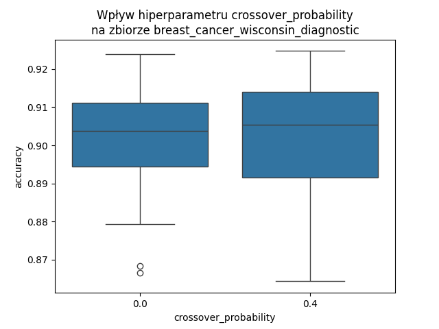
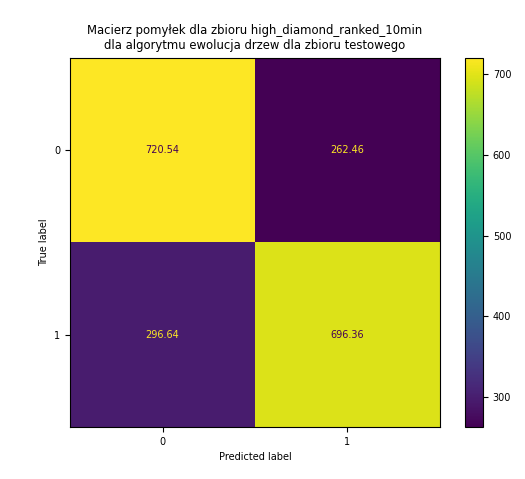

\newcommand{\ctext}[3][RGB]{%

}

# UMA Projekt – Ewolucja drzewa
## Dokumentacja końcowa
Skład zespołu:\
Jakub Proboszcz 318713\
Paweł Kochański 318673

### 1. Temat projektu
„Ewolucja drzewa\
Tworzenie drzewa decyzyjnego przy pomocy algorytmu ewolucyjnego. Zwykle klasyfikatory budowane są w oparciu o metodę zachłanną - w kolejnym kroku wybieramy lokalnie najlepszy podział. Takie podejście jest bardzo szybkie jednak nie zawsze prowadzi do utworzenia optymalnej struktury drzewa.”

### 2. Ustalenia z dokumentacji wstępnej i konsultacji

#### Doprecyzowanie tematu\
Zaimplementowanie algorytmu tworzącego na podstawie danych wejściowych drzewo decyzyjne z użyciem metod typowych dla algorytmu ewolucyjnego. Algorytm ewolucyjny umożliwia eksplorację różnych konfiguracji, dążąc do znalezienia bardziej globalnie optymalnego drzewa decyzyjnego, w odróżnieniu od zachłannych metod stosowanych w zwykłych klasyfikatorach. Zbadanie efektywności powstałych drzew i porównanie ich z istniejącą implementacją algorytmu ID3.


#### Wybrany wariant drzewa decyzyjnego\
W używanym przez nas wariancie drzewa decyzyjnego każdemu węzłowi niebędącemu liściem przypisany jest **atrybut** $a(x)$ i **wartość graniczna** $A$. Każdy taki węzeł ma 2 dzieci - lewe jest wybierane, jeżeli (dla obecnie rozważanego przykładu $\bar{x}$) spełniony jest warunek $a(\bar{x})<A$, a prawe w przeciwnym przypadku ($a(\bar{x})\ge A$).

Każdemu liściowi przyporządkowana jest **klasa**, przydzielana przykładom które do tego liścia trafią.

Z takich drzew składa się populacja w zaimplementowanym przez nas algorytmie ewolucyjnym.


#### Inicjalizacja populacji\
Każdy węzeł każdego drzewa w populacji startowej jest generowany następująco:\
Jeżeli osiągnięto maksymalną głębokość drzewa, lub z prawdopodobieństwem ```leaf_probability(depth)```, węzeł będzie liściem.\
Jeżeli węzeł jest liściem, przypisywana jest mu klasa odpowiadająca klasie większościowej (w przypadku wieloklasowym - najliczniejszej) z części zbioru danych, która trafia do tego liścia.\
Jeżeli w tym podzbiorze jest kilka równolicznych najliczniejszych klas, wybierana jest losowa z nich.\
Jeżeli węzeł nie jest liściem, losowany jest atrybut, według którego następuje podział. Następnie, granica podziału jest losowana z dziedziny tego atrybutu. Dzieci tego węzła są generowane rekurencyjnie; zbiór danych otrzymany przez ten węzeł jest dzielony według wylosowanego atrybutu i granicy podziału, i podzbiory są przekazywane dzieciom.\
\ctext[RGB]{255,255,0}{Jeżeli zdarzy się sytuacja, że oboje dzieci danego węzła to liście z tą samą klasą, lub jedno z dzieci węzła otrzymałoby pusty zbiór danych, zamiast tego węzła wewnętrznego powstanie liść.}


#### Reprodukcja\
Wykonaliśmy eksperymenty z użyciem 4 wariantów reprodukcji: proporcjonalnej, rangowej, progowej i turniejowej. W naszym algorytmie ewolucji drzewa działają one tak samo, jak w zwykłym algorytmie ewolucyjnym.


#### Mutacja\
Mutacja polega na wylosowaniu jednego spośród węzłów drzewa. Z prawdopodobieństwem ```leaf_inner_swap_probability``` jest on zamieniany z liścia na węzeł wewnętrzny lub odwrotnie.\
Przy zmianie z liścia na węzeł wewnętrzny, atrybut, granica podziału i dzieci są generowane tak, jak w przypadku inicjalizacji, z tym, że dzieci zawsze będą liśćmi. Zamiana nie ma skutku, jeżeli drzewo przekroczyłoby maksymalną głębokość, \ctext[RGB]{255,255,0}{lub jedno z dzieci otrzymałoby pusty zbiór danych, lub jeżeli oboje dzieci miałyby taką samą klasę}.\
Przy zmianie z węzła wewnętrznego na liść, klasa nowego liścia jest ustalana na \ctext[RGB]{255,255,0}{najliczniejszą klasę w zbiorze danych tego węzła}. Poddrzewo tego węzła jest odrzucane.\
Jeżeli nie zachodzi taka zamiana, \ctext[RGB]{255,255,0}{będzie wylosowany węzeł wewnętrzny. Jego atrybut jest zmieniany na losowy, a granica podziału jest ponownie losowana z dziedziny nowo wylosowanego atrybutu. Następnie, klasy wszystkich liści w poddrzewie tego węzła są przeliczane tak, jak w przypadku inicjalizacji. Może nastąpić zwinięcie części drzewa, jeżeli powstałyby węzły z pustym zbiorem danych lub sąsiadujące liście z tą samą klasą.}


#### Krzyżowanie\
Krzyżowanie polega na wyborze dwóch węzłów w obu krzyżowanych drzewach oraz zamianie ich miejscami, razem z ich poddrzewami.\
Jeżeli jedno z drzew potomnych ma głębokość większą niż parametr ```max_depth```, to zamiast niego jest zwracany jeden z rodziców.\
\ctext[RGB]{255,255,0}{Po krzyżowaniu liście w zamienionych poddrzewach zostaną przeliczone, analogicznie jak w przypadku inicjalizacji. Może nastąpić zwinięcie części drzewa, jeżeli powstałyby węzły z pustym zbiorem danych lub sąsiadujące liście z tą samą klasą.}\

\ctext[RGB]{255,255,0}{Ze względu na to, że poszczególne węzły nie przechowują informacji, jaka część zbioru danych do nich trafia (z powodu problemów z brakiem pamięci), gdy przeliczana jest część drzewa, przeliczane jest od razu całe drzewo. W niezmienionych częściach drzewa jedyna zmiana, jaka może zajść, to zmiana klasy liścia jeżeli podzbiór przypadający na ten liść zawiera co najmniej dwie równoliczne najliczniejsze klasy. Taka zmiana nie zmienia oceny drzewa na zbiorze treningowym - liczba poprawnie zaklasyfikowanych przykładów nie ulega zmianie.}


#### Sukcesja\
Wykonywaliśmy eksperymenty z użyciem 2 wariantów sukcesji: generacyjnej i elitarnej. W naszym algorytmie ewolucji drzewa działają one tak samo, jak w zwykłym algorytmie ewolucyjnym.


#### Funkcja oceny\
Funkcją oceny używaną przez nas jest dokładność (*accuracy*), czyli iloraz liczby przykładów ze zbioru treningowego, któremu dane drzewo przydzieliło właściwą klasę oraz liczby wszystkich przykładów w zbiorze treningowym. Funkcja ta jest **maksymalizowana**.


#### Wybrane zbiory danych\
Wybraliśmy pięć zbiorów danych:

               nazwa zbioru danych  liczba atrybutów   liczba klas   liczba przykładów
---------------------------------- ------------------ ------------- -------------------
       glass_identification               9              6             214
         dry_bean_dataset                 16             7            13611
breast_cancer_wisconsin_diagnostic        30             2             569
               wine                       13             3             178
    high_diamond_ranked_10min             38             2            9879


Hiperłącza do nich oraz liczności ich klas są wymienione poniżej.

Zbiór danych glass_identification [[link]](http://archive.ics.uci.edu/dataset/42/glass+identification):

Przewidywanie rodzaju szkła na podstawie jego własności fizykochemicznych.

 nazwa klasy liczba wystąpień
------------ ----------------
     1             70
     2             76
     3             17
     5             13
     6             9
     7             29

Zbiór danych dry_bean_dataset [[link]](http://archive.ics.uci.edu/dataset/602/dry+bean+dataset):

Przewidywanie gatunku suszonej fasoli na podstawie cech zdjęcia pojedynczej fasolki.

 nazwa klasy liczba wystąpień
------------ ----------------
 BARBUNYA         1322
  BOMBAY          522
   CALI           1630
 DERMASON         3546
   HOROZ          1928
   SEKER          2027
   SIRA           2636

   Zbiór danych breast_cancer_wisconsin_diagnostic [[link]](http://archive.ics.uci.edu/dataset/17/breast+cancer+wisconsin+diagnostic):

Diagnoza rodzaju raka piersi na podstawie właściwości komórek pobranych z piersi.

 nazwa klasy liczba wystąpień
------------ ----------------
     B            357
     M            212

Zbiór danych wine [[link]](http://archive.ics.uci.edu/dataset/109/wine):

Przewidywanie rodzaju wina na podstawie jego cech fizykochemicznych.

 nazwa klasy liczba wystąpień
------------ ----------------
     1             59
     2             71
     3             48

Zbiór danych high_diamond_ranked_10min [[link]](https://www.kaggle.com/datasets/bobbyscience/league-of-legends-diamond-ranked-games-10-min):

Przyporządkowanie wyników (zwycięstwo/porażka) meczy rankingowych w grze „League of Legends" na podstawie statystyk meczu pobranych w jego dziesiątej minucie trwania.

 nazwa klasy liczba wystąpień
------------ ----------------
     0            4949
     1            4930


#### Metoda referencyjna\
Wyniki uzyskane przez nasz algorytm porównujemy z wynikami istniejącej implementacji algorytmu ID3:\
[ID3 - hiperłącze](https://pypi.org/project/decision-tree-id3/)


### 3. Poprawność implementacji

W celu weryfikacji poprawności implementacji algorytmu, przygotowaliśmy testy jednostkowe do niektórych jego części składowych. Są one zawarte w plikach test_tree.py, test_genetic_operations.py oraz test_succession.py. Ponadto, sprawdziliśmy poprawność reprodukcji w pliku manual_testing.ipynb - rysujemy histogram przybliżający, jak zostają wybrane osobniki w każdej z reprodukcji.

Poprawność całości implementacji algorytmu pokazuje porównanie z wynikami algorytmu ID3, zawarte w poniższej sekcji.


### 4. Eksperymenty

#### Przeszukiwanie po hipersiatce hiperparametrów\
Skrypt wykonujący poniższy eksperyment jest zawarty w pliku experiments_evotree.py. Dane z eksperymentów były agregowane i rysowane na wykresach skryptem aggregate_results.py. Dodatkowe eksperymenty z poniższej sekcji były wykonywane z pomocą skryptu single_experiment.py - hiperparametry były określane bezpośrednio w skrypcie.

Uruchomiliśmy nasz algorytm dla $128$ różnych kombinacji hiperparametrów. Liczba ta została ustalona na podstawie przewidywanego czasu obliczeń - obliczenia zajęły kilka dni. Sprawdzane były następujące wartości każdego z hiperparametrów:\
- ```max_depth``` - maksymalna głębokość drzewa w populacji - wartości $5$ oraz $20$;\
- ```reproduction``` - sprawdzane były reprodukcje: proporcjonalna, rangowa z parametrami \ctext[RGB]{255,255,0}{$a=0{,}01$ i $k\approx 0{,}084$}, progowa z progiem $0{,}8$, turniejowa z rozmiarem turnieju $2$;\
- ```mutation_probability``` - prawdopodobieństwo zajścia mutacji dla każdego drzewa w populacji - wartości $0{,}4$ oraz $0{,}8$;\
- ```leaf_inner_swap_probability``` - prawdopodobieństwo zamiany liścia w węzeł wewnętrzny lub odwrotnie podczas mutacji - wartości $0$ oraz $0{,}3$;\
- ```crossover_probability``` - prawdopodobieństwo zajścia krzyżowania dla każdej pary drzew - wartości $0$ oraz $0{,}4$;\
- ```succession``` - sprawdzane były sukcesje: generacyjna oraz elitarna dla rozmiaru elity $2$.

Prawdopodobieństwo, że węzeł będzie liściem podczas inicjalizacji ustaliliśmy na $1-\left(\frac{1}{2}\right)^g$, gdzie $g$ to głębokość tego węzła (korzeń ma głębokość $0$).

Przyjęliśmy rozmiar populacji równy $20$ - czas działania algorytmu nie pozwolił na optymalizację tego hiperparametru.

Przyjęliśmy maksymalną liczbę iteracji równą $500$; obliczenia są również zatrzymywane gdy ocena najlepszego drzewa nie poprawi się w ciągu $50$ kolejnych iteracji. Warunek ten jest sprawdzany co $50$-tą iterację.

Eksperyment został wykonany dla wszystkich $5$ zbiorów danych. Z ich wszystkich został wydzielony zbiór testowy wielkości $0{,}2$ całego zbioru. Dla każdej kombinacji hiperparametrów wykonano \ctext[RGB]{255,255,0}{$5$ } uruchomień $5$-krotnej walidacji krzyżowej na zbiorze bez zbioru testowego, dla każdego zbioru danych. Na poniższych wykresach są przedstawione uśrednione dokładności na zbiorach walidacyjnych z tych \ctext[RGB]{255,255,0}{$25$ } uruchomień algorytmu.

#### Wpływ hiperparametru ```max_depth``` na działanie algorytmu\

{ width=370px } { width=370px }\
{ width=370px } { width=370px }\
{ width=370px } { width=370px }\
{ width=370px } { width=370px }\
{ width=370px } { width=370px }\

Jak widać na wykresach, wartość hiperparametru ```max_depth``` nie wpłynęła znacząco na wyniki algorytmu \ctext[RGB]{255,255,0}{dla zbiorów z małą liczbą klas}. Oznacza to, że \ctext[RGB]{255,255,0}{dla tych zbiorów } lepsze są niższe wartości ```max_depth``` - skoro płytsze drzewa wystarczają, to nie ma sensu próbować konstruować głębszych, dla których operacje (w szczególności predykcja) są wolniejsze, i występuje większe ryzyko nadmiernego dopasowania. \ctext[RGB]{255,255,0}{Dla zbiorów o większej liczbie klas - \texttt{glass\_identification} oraz \texttt{dry\_bean\_dataset} - większa wartość \texttt{max\_depth} uzyskała nieco lepsze wyniki - przy większej liczbie klas jest sens konstruować głębsze drzewa.}

#### Wpływ hiperparametru ```reproduction``` na działanie algorytmu\

{ width=370px } { width=370px }\
{ width=370px } { width=370px }\
{ width=370px } { width=370px }\
{ width=370px } { width=370px }\
{ width=370px } { width=370px }\

\ctext[RGB]{255,255,0}{Wyniki są podobne dla wszystkich $4$ reprodukcji. Dla różnych zbiorów danych różne okazały się być najlepsze reprodukcje. Nie można wyciągnąć wniosku na temat tego, czy któraś jest ogólnie najlepsza - dla każdego zbioru danych trzeba to ustalać niezależnie.}

#### Wpływ hiperparametru ```mutation_probability``` na działanie algorytmu\

{ width=370px } { width=370px }\
{ width=370px } { width=370px }\
{ width=370px } { width=370px }\
{ width=370px } { width=370px }\
{ width=370px } { width=370px }\

\ctext[RGB]{255,255,0}{Obie testowane wartości prawdopodobieństwa mutacji okazały się być podobnie dobre. Oznacza to, że najprawdopodobniej wynikowe drzewo było uzyskiwane w liczbie iteracji mniejszej niż maksymalna, i niezależnie od prawdopodobieństwa mutacji wykonywane było wystarczająco operacji mutacji do znalezienia takiego drzewa.}

\ctext[RGB]{255,255,0}{Przeprowadziliśmy dodatkowe eksperymenty z prawdopodobieństwem mutacji na zbiorze \texttt{glass\_identification} - jedynym, dla którego na powyższych wykresach jest zauważalna różnica między \texttt{mutation\_probability} $0{,}4$ i $0{,}8$. } Wyniki w poniższej tabeli to zagregowane dokładności z \ctext[RGB]{255,255,0}{$5$-krotnie } powtórzonej $5$-krotnej walidacji krzyżowej (używany był zbiór bez zbioru testowego) \ctext[RGB]{255,255,0}{na zbiorze \texttt{glass\_identification}}. Wartości pozostałych hiperparametrów były takie, jak dla najlepszej kombinacji hiperparametrów dla tego zbioru danych.

 p.mutacji     średnia      odchylenie standardowe   dokładność minimalna   dokładność maksymalna
------------ ------------  ------------------------ ---------------------- -----------------------
  $0{,}0$       0,50              0,10                      0,29                 0,68
  $0{,}2$       0,60              0,07                      0,50                 0,76
  $0{,}4$     **0,64**          **0,10**                  **0,49**             **0,85**
  $0{,}6$       0,59              0,10                      0,41                 0,85
  $0{,}8$       0,60              0,10                      0,38                 0,79
  $1{,}0$       0,60              0,11                      0,44                 0,82

\ctext[RGB]{255,255,0}{Jak widać, zmiana prawdopodobieństwa mutacji nie wpływa znacząco na wyniki algorytmu. Wygląda na to, że lepszy wynik dla \texttt{mutation\_probability=0,4} jest wartością odstającą i nie można go traktować jako podstawy do daleko idących wniosków. Warto zaznaczyć, że dla \texttt{mutation\_probability=0,2} eksperyment trwał znacznie dłużej niż dla pozostałych wartości, co popiera hipotezę, że wynikowe drzewo było uzyskiwane w liczbie iteracji mniejszej niż maksymalna, i niezależnie od prawdopodobieństwa mutacji wykonywane było wystarczająco operacji mutacji do znalezienia takiego drzewa.}

\ctext[RGB]{255,255,0}{Dla kompletnie wyłączonej mutacji (drzewa zmieniały się tylko poprzez krzyżowanie) wynik okazał się być znacznie gorszy, co jest spodziewane.}

#### Wpływ hiperparametru ```leaf_inner_swap_probability``` na działanie algorytmu\

{ width=370px } { width=370px }\
{ width=370px } { width=370px }\
{ width=370px } { width=370px }\
{ width=370px } { width=370px }\
{ width=370px } { width=370px }\

\ctext[RGB]{255,255,0}{Obecność zamiany liścia w węzeł wewnętrzny, lub odwrotnie, również nie zmienia znacząco wyników algorytmu dla najlepszych kombinacji hiperparametrów. Jednakże, średnie wyniki (czyli dla nieoptymalnych hiperparametrów) są zdecydowanie wyższe przy \texttt{leaf\_inner\_swap\_probability=0,3} dla wszystkich zbiorów poza \texttt{high\_diamond\_ranked\_10min}. Ten zbiór może być wyjątkiem, ponieważ jest duży (prawie 10000 przykładów) i dwuklasowy - dla dowolnych hiperparametrów wyniki na tym zbiorze były podobne, co sugeruje, że dla tego zbioru drzewo bliskie optymalnemu można znaleźć łatwo i nie potrzeba szczególnego strojenia hiperparametrów.}

\ctext[RGB]{255,255,0}{Dla zbioru \texttt{wine} różnica jest zauważalna (choć wciąż niewielka) także dla najlepszej kombinacji hiperparametrów, dlatego dla tego zbioru przeprowadziliśmy dodatkowe eksperymenty. } Wyniki w poniższej tabeli to zagregowane dokładności z \ctext[RGB]{255,255,0}{$5$-krotnie } powtórzonej $5$-krotnej walidacji krzyżowej (używany był zbiór bez zbioru testowego) \ctext[RGB]{255,255,0}{na zbiorze \texttt{wine}}. Wartości pozostałych hiperparametrów były takie, jak dla najlepszej kombinacji hiperparametrów dla tego zbioru danych.

 p.zamiany     średnia      odchylenie standardowe   dokładność minimalna   dokładność maksymalna
------------ ------------  ------------------------ ---------------------- -----------------------
  $0{,}00$      0,92             0,05                     0,82                   1,00
  $0{,}15$      0,90             0,06                     0,76                   1,00
  $0{,}30$    **0,93**         **0,03**                 **0,86**               **1,00**
  $0{,}45$      0,91             0,05                     0,82                   1,00
  $0{,}60$      0,91             0,05                     0,79                   1,00
  $0{,}75$      0,90             0,06                     0,75                   1,00
  $0{,}90$      0,90             0,07                     0,69                   1,00

\ctext[RGB]{255,255,0}{Jak widać, dla większych prawdopodobieństw zamiany średnie i minimalne wyniki algorytmu się pogorszyły. Jednakże, w każdym przypadku udało się znaleźć co najmniej jedno drzewo z dokładnością na zbiorze walidacyjnym równą $1{,}00$, a różnice w średnich są mniejsze od odchylenia standardowego. Większe prawdopodobieństwo zamiany, dla kombinacji hiperparametrów dającej najlepsze wyniki, nieco pogarsza wyniki algorytmu.}

\ctext[RGB]{255,255,0}{W powyższym eksperymencie krzyżowanie było \textbf{włączone}, zatem niezależnie od prawdopodobieństwa zamiany była możliwość zmiany struktury drzewa podczas optymalizacji. Poniższa tabela przedstawia wyniki analogicznego eksperymentu dla prawdopodobieństwa krzyżowania równego $0$.}

 p.zamiany     średnia      odchylenie standardowe   dokładność minimalna   dokładność maksymalna
------------ ------------  ------------------------ ---------------------- -----------------------
  $0{,}00$      0,86             0,07                     0,71                   0,96
  $0{,}15$    **0,91**         **0,05**                 **0,79**               **1,00**
  $0{,}30$    **0,91**         **0,05**                 **0,76**               **1,00**
  $0{,}45$      0,89             0,05                     0,76                   0,97
  $0{,}60$    **0,91**         **0,07**                 **0,72**               **1,00**
  $0{,}75$      0,90             0,05                     0,79                   1,00
  $0{,}90$      0,88             0,05                     0,79                   1,00

\ctext[RGB]{255,255,0}{W tym przypadku również różne wartości prawdopodobieństwa zamiany nie wpłynęły znacząco na wyniki algorytmu. Jednakże, widoczne jest pogorszenie wyników dla prawdopodobieństwa zamiany $0$ - w takim przypadku nie było możliwości zmiany struktury drzewa (poza okazjonalnym zwijaniem niepotrzebnych liści przy mutacji).}

#### Wpływ hiperparametru ```crossover_probability``` na działanie algorytmu\

{ width=370px } { width=370px }\
{ width=370px } { width=370px }\
{ width=370px } { width=370px }\
{ width=370px } { width=370px }\
{ width=370px } { width=370px }\

\ctext[RGB]{255,255,0}{Obecność krzyżowania wpływa na wyniki algorytmu podobnie jak prawdopodobieństwo zamiany - przy najlepszych hiperparametrach zmiana jest nieznaczna, jednakże średnia ze wszystkich kombinacji hiperparametrów poprawia się znacząco, za wyjątkiem zbioru \texttt{high\_diamond\_ranked\_10min}.}

\ctext[RGB]{255,255,0}{Dla zbioru \texttt{glass\_identification} różnica jest zauważalna (choć wciąż niewielka) także dla najlepszej kombinacji hiperparametrów, dlatego dla tego zbioru przeprowadziliśmy dodatkowe eksperymenty. Wyniki w poniższej tabeli to zagregowane dokładności z $5$-krotnie powtórzonej $5$-krotnej walidacji krzyżowej (używany był zbiór bez zbioru testowego) na zbiorze \texttt{glass\_identification}. Wartości pozostałych hiperparametrów były takie, jak dla najlepszej kombinacji hiperparametrów dla tego zbioru danych.}

 p.zamiany     średnia      odchylenie standardowe   dokładność minimalna   dokładność maksymalna
------------ ------------  ------------------------ ---------------------- -----------------------
  $0{,}0$       0,57               0,09                    0,41                   0,82
  $0{,}2$       0,60               0,10                    0,43                   0,82
  $0{,}4$     **0,64**           **0,10**                **0,49**               **0,85**
  $0{,}6$     **0,64**           **0,11**                **0,49**               **0,88**
  $0{,}8$       0,62               0,09                    0,49                   0,79
  $1{,}0$       0,59               0,10                    0,46                   0,82

\ctext[RGB]{255,255,0}{Jak widać, zbyt duże lub zbyt małe wartości prawdpodobieństwa krzyżowania pogarszają wyniki algorytmu - najlepsze wartości są w okolicach $0{,}4-0{,}6$. Warto zauważyć, że w powyższym eksperymencie zamiana liścia na węzeł wewnętrzny i odwrotnie była wyłączona - w tej sytuacji krzyżowanie jest jedynym źródłem zmian struktury drzewa (poza zwijaniem niepotrzebnych liści przy mutacji). Może to prowadzić do większego wpływu prawdopodobieństwa krzyżowania na wyniki algorytmu.}

#### Wpływ hiperparametru ```succession``` na działanie algorytmu\

{ width=370px } { width=370px }\
{ width=370px } { width=370px }\
{ width=370px } { width=370px }\
{ width=370px } { width=370px }\
{ width=370px } { width=370px }\

Elitarna sukcesja zdecydowanie polepszyła wyniki algorytmu w stosunku do sukcesji generacyjnej. Wynika to z tego, że mutacja zmienia drzewa dość mocno - nawet mutacja bez zamiany liścia w węzeł wewnętrzny lub odwrotnie może bardzo popsuć jakość drzewa, np. zmieniając test w korzeniu. W związku z tym, zachowanie najlepszych osobników w populacji jest konieczne - możliwe, że dopiero po wielu iteracjach uzyskana zostanie poprawa, szybka strata dobrego osobnika uniemożliwi jakąkolwiek eksploatację jego okolic.

#### Najlepsze zestawy hiperparametrów\
Wyniki w poniższej tabeli to dokładności na zbiorze walidacyjnym, zagregowane z \ctext[RGB]{255,255,0}{$5$-krotnie } powtórzonej 5-krotnej walidacji krzyżowej, dla najlepszych (o najlepszej średniej dokładności) zestawów hiperparametrów dla każdego ze zbiorów danych.

 z.danych      max_depth      reprodukcja      p.mut.   p.zamiany   p.krzyż.   sukcesja   średnia   odch.stan.   najgorszy   najlepszy
---------- ----------------- ---------------- -------- ----------- ---------- ---------- --------- ------------ ----------- ------------
 cancer            5          proporcjonalna   0,4      0,3         0,4        elitarna     0,94       0,02          0,88       0,98
  bean             20         rangowa          0,8      0,3         0,0        elitarna     0,89       0,01          0,88       0,90
 glass             20         turniejowa       0,4      0,0         0,4        elitarna     0,64       0,10          0,49       0,85
 wine              5          rangowa          0,4      0,3         0,4        elitarna     0,93       0,03          0,86       1,00
 games             20         proporcjonalna   0,4      0,0         0,4        elitarna     0,73       0,01          0,71       0,75

#### Nadmierne dopasowanie\

W celu ustalenia, czy wystąpiło nadmierne dopasowanie, wyliczyliśmy wartości dokładności dla algorytmu ewolucji drzewa dla zbiorów treningowego (tego, który wcześniej był używany do walidacji krzyżowej) i testowego.

Poniższe tabele przedstawiają wyniki (dokładności) naszego algorytmu ewolucji drzewa na zbiorach treningowym i testowym, zagregowane z \ctext[RGB]{255,255,0}{$25$ } uruchomień algorytmu.

Dla zbioru danych ```glass_identification```:

 zbiór danych   średnia dokładność   odchylenie standardowe   dokładność minimalna   dokładność maksymalna
-------------- -------------------- ------------------------ ---------------------- -----------------------
 treningowy              0,78                 0,04                  0,70                 0,83
 testowy                 0,74                 0,04                  0,67                 0,84

Dla zbioru danych ```dry_bean_dataset```:

 zbiór danych   średnia dokładność   odchylenie standardowe   dokładność minimalna   dokładność maksymalna
-------------- -------------------- ------------------------ ---------------------- -----------------------
 treningowy              0,89                 0,01                  0,88                 0,90
 testowy                 0,89                 0,01                  0,88                 0,90

Dla zbioru danych ```breast_cancer_wisconsin_diagnostic```:

 zbiór danych   średnia dokładność   odchylenie standardowe   dokładność minimalna   dokładność maksymalna
-------------- -------------------- ------------------------ ---------------------- -----------------------
 treningowy              0,95                 0,01                  0,93                 0,97
 testowy                 0,94                 0,02                  0,89                 0,96

Dla zbioru danych ```wine```:

 zbiór danych   średnia dokładność   odchylenie standardowe   dokładność minimalna   dokładność maksymalna
-------------- -------------------- ------------------------ ---------------------- -----------------------
 treningowy              0,98                 0,01                  0,95                 1,00
 testowy                 0,93                 0,05                  0,83                 1,00

Dla zbioru danych ```high_diamond_ranked_10min```:

 zbiór danych   średnia dokładność   odchylenie standardowe   dokładność minimalna   dokładność maksymalna
-------------- -------------------- ------------------------ ---------------------- -----------------------
 treningowy              0,73                 0,00                  0,72                 0,74
 testowy                 0,72                 0,01                  0,71                 0,74

\ctext[RGB]{255,255,0}{Dla zbiorów \texttt{dry\_bean\_dataset}, \texttt{breast\_cancer\_wisconsin\_diagnostic} oraz \texttt{high\_diamond\_ranked\_10min} wyniki algorytmu są praktycznie takie same dla zbiorów treningowego i testowego, zatem nadmierne dopasowanie nie wystąpiło. Dla pozostałych zbiorów dokładność na zbiorze testowym jest nieco gorsza (różnica $0{,}04-0{,}05$), zatem wystąpiło lekkie nadmierne dopasowanie.}

#### Porównanie z algorytmem ID3\
Skrypt wykonujący poniższy eksperyment jest zawarty w pliku comparison_experiment.py.

Wykonaliśmy analogiczne przeszukiwanie po hipersiatce hiperparametrów dla metody referencyjnej - algorytmu ID3. Sprawdzane były następujące wartości hiperparametrów:\
- ```max_depth``` - maksymalna głębokość drzewa w populacji - wartości $5$ oraz $20$;\
- ```min_samples_split``` - minimalna liczba przykładów w węźle niezbędna, aby rozważany był dalszy jego podział - wartości $1$, $2$ i $10$;\
- ```prune``` - czy wykonywane będzie przycinanie drzewa - wartości *True* oraz *False*;\
- ```gain_ratio``` - czy używane będzie ```gain ratio``` zamiast ```information gain``` do wyboru podziału węzła - wartości *True* oraz *False*;\
- ```min_entropy_decrease``` - minimalna wartość entropii, przy której wykonywany jest dalszy podział węzła - wartości $0$ oraz $0{,}3$;\
- ```repeating``` - czy będą wykonywane wielokrotne podziały po tym samym atrybucie - wartości *True* oraz *False*.

Najlepsze (o najlepszej średniej dokładności) kombinacje hiperparametrów dla poszczególnych zbiorów danych są przedstawione w poniższej tabeli.

Wyniki w poniższej tabeli to dokładności na zbiorze walidacyjnym, zagregowane z \ctext[RGB]{255,255,0}{$5$-krotnie } powtórzonej $5$-krotnej walidacji krzyżowej.

 z.danych   ```max_depth```   ```min_samp```   ```prune```     ```gain_ratio```   ```min_e_dec```   ```repeating```   średnia    odch.stan.   najgorszy   najlepszy
---------- ----------------- ---------------- --------------- ------------------ ----------------- ----------------- ---------- ------------ ----------- -----------
 cancer         $5$              $1$           *False*         *False*               0                *True*          $0{,}95$   $0{,}03$     $0{,}91$    $0{,}98$
  bean          $20$             $10$          *True*          *False*               0,3              *False*         $0{,}90$   $0{,}01$     $0{,}89$    $0{,}91$
 glass          $20$             $1$           *False*         *False*               0                *True*          $0{,}64$   $0{,}03$     $0{,}60$    $0{,}68$
 wine           $5$              $1$           *False*         *False*               0                *False*         $0{,}89$   $0{,}05$     $0{,}82$    $0{,}97$
 games          $5$              $10$          *False*         *True*                0                *True*          $0{,}72$   $0{,}01$     $0{,}71$    $0{,}74$

Dla najlepszych hiperparametrów przedstawionych w dwóch powyższych tabelach, uruchomiliśmy algorytmy ponownie. Jako zbiór treningowy został użyty cały zbiór używany wcześniej do walidacji krzyżowej. Ewaluacja została wykonana na wydzielonym uprzednio zbiorze testowym.

Poniższe tabele przedstawiają wyniki (dokładności) naszego algorytmu ewolucji drzewa i algorytmu ID3 na zbiorze testowym, zagregowane z \ctext[RGB]{255,255,0}{$25$ } uruchomień algorytmu.

Dla zbioru danych ```glass_identification```:

 algorytm          średnia dokładność   odchylenie standardowe   dokładność minimalna   dokładność maksymalna
----------------- -------------------- ------------------------ ---------------------- -----------------------
 ewolucja drzewa           0,74                 0,04                  0,67                 0,84
 ID3                       0,74                 0,00                  0,74                 0,74

Dla zbioru danych ```dry_bean_dataset```:

 algorytm          średnia dokładność   odchylenie standardowe   dokładność minimalna   dokładność maksymalna
----------------- -------------------- ------------------------ ---------------------- -----------------------
 ewolucja drzewa           0,89                 0,01                  0,88                 0,90
 ID3                       0,91                 0,00                  0,90                 0,91

Dla zbioru danych ```breast_cancer_wisconsin_diagnostic```:

 algorytm          średnia dokładność   odchylenie standardowe   dokładność minimalna   dokładność maksymalna
----------------- -------------------- ------------------------ ---------------------- -----------------------
 ewolucja drzewa              0,94                 0,02                  0,89                 0,96
 ID3                          0,94                 0,00                  0,94                 0,94

Dla zbioru danych ```wine```:

 algorytm          średnia dokładność   odchylenie standardowe   dokładność minimalna   dokładność maksymalna
----------------- -------------------- ------------------------ ---------------------- -----------------------
 ewolucja drzewa             0,93                 0,05                  0,83                 1,00
 ID3                         0,92                 0,00                  0,92                 0,92

Dla zbioru danych ```high_diamond_ranked_10min```:

 algorytm          średnia dokładność   odchylenie standardowe   dokładność minimalna   dokładność maksymalna
----------------- -------------------- ------------------------ ---------------------- -----------------------
 ewolucja drzewa             0,72                 0,01                  0,71                 0,74
 ID3                         0,72                 0,00                  0,72                 0,72

\ctext[RGB]{255,255,0}{Dla wszystkich zbiorów danych oba algorytmy osiągnęły bardzo podobne średnie wyniki. Jednakże, w przypadku $4$ z $5$ zbiorów danych algorytm ewolucji drzewa osiągnął lepszy maksymalny wynik niż ID3. Jest to rezultat spodziewany - jako metoda optymalizacji globalnej, algorytm ewolucyjny ma potencjał znalezienia lepszego drzewa niż zachłanny algorytm ID3.}

Algorytm ewolucji drzewa jest przeszukiwaniem w dużej mierze polegającym na losowości - widać to po zdecydowanie większych odchyleniach standardowych wyników.

Poniższe tabele przedstawiają wyniki (dokładności) algorytmu ID3 na zbiorach treningowym i testowym, zagregowane z \ctext[RGB]{255,255,0}{$25$ } uruchomień algorytmu.

Dla zbioru danych ```glass_identification```:

 zbiór danych   średnia dokładność   odchylenie standardowe   dokładność minimalna   dokładność maksymalna
-------------- -------------------- ------------------------ ---------------------- -----------------------
 treningowy              1,00                 0,00                  1,00                 1,00
 testowy                 0,74                 0,00                  0,74                 0,74

Dla zbioru danych ```dry_bean_dataset```:

 zbiór danych   średnia dokładność   odchylenie standardowe   dokładność minimalna   dokładność maksymalna
-------------- -------------------- ------------------------ ---------------------- -----------------------
 treningowy              0,93                 0,00                  0,92                 0,94
 testowy                 0,91                 0,00                  0,90                 0,91

Dla zbioru danych ```breast_cancer_wisconsin_diagnostic```:

 zbiór danych   średnia dokładność   odchylenie standardowe   dokładność minimalna   dokładność maksymalna
-------------- -------------------- ------------------------ ---------------------- -----------------------
 treningowy              0,99                 0,00                  0,99                 0,99
 testowy                 0,94                 0,00                  0,94                 0,94

Dla zbioru danych ```wine```:

 zbiór danych   średnia dokładność   odchylenie standardowe   dokładność minimalna   dokładność maksymalna
-------------- -------------------- ------------------------ ---------------------- -----------------------
 treningowy              1,00                 0,00                  1,00                 1,00
 testowy                 0,92                 0,00                  0,92                 0,92

Dla zbioru danych ```high_diamond_ranked_10min```:

 zbiór danych   średnia dokładność   odchylenie standardowe   dokładność minimalna   dokładność maksymalna
-------------- -------------------- ------------------------ ---------------------- -----------------------
 treningowy              0,73                 0,00                  0,73                 0,73
 testowy                 0,72                 0,00                  0,72                 0,72

Algorytm ID3 osiągnął znacząco lepsze wyniki na zbiorze treningowym niż na testowym w przypadku \ctext[RGB]{255,255,0}{małych zbiorów danych (\texttt{glass\_identification}, \texttt{breast\_cancer\_wisconsin\_diagnostic} oraz \texttt{wine}) - wystąpiło nadmierne dopasowanie}. Oznacza to, że algorytm ewolucji drzewa jest mniej podatny na nadmierne dopasowanie niż algorytm ID3.

Poniżej przedstawione są macierze pomyłek (wyniki na zbiorze testowym, uśrednione dla \ctext[RGB]{255,255,0}{$25$ } uruchomień algorytmu) algorytmu ewolucji drzewa i ID3 dla poszczególnych zbiorów danych.

{ width=370px } { width=370px }

{ width=370px } { width=370px }

{ width=370px } { width=370px }

Macierze pomyłek dla zbiorów danych z mniejszą liczbą klas nie wykazują żadnych anomalii, ani znaczących różnic między obydwoma algorytmami.

{ width=370px } { width=370px }

{ width=370px } { width=370px }

Dla zbiorów danych z większą liczbą klas, algorytm ID3 nie ignoruje żadnej z klas - nawet klasy mające bardzo małą liczbę przykładów są w większości poprawnie klasyfikowane. Algorytm ewolucji drzewa \ctext[RGB]{255,255,0}{natomiast zignorował mało liczną klasę - klasa 3 w zbiorze danych \texttt{glass\_identification} była przewidywana bardzo rzadko.}

Macierze pomyłek ponownie pokazują to, co wynika również z tabel - \ctext[RGB]{255,255,0}{średnio, oba algorytmy sprawują się podobnie dobrze.}

### 5. Końcowe wnioski

Implementacja algorytmu ewolucji drzewa jest poprawna; osiągnął on wyniki porównywalne z metodą referencyjną.

Algorytm ewolucji drzewa nadaje się do zadań klasyfikacji, \ctext[RGB]{255,255,0}{zarówno dwuklasowych, jak i wieloklasowych}.

Algorytm ewolucji drzewa nie jest szczególnie podatny na nadmierne dopasowanie.

W porównaniu z algorytmem ID3, algorytm ewolucji drzewa średnio osiąga porównywalne wyniki. Jednakże, czas jego wykonania jest znacznie dłuższy, zatem jest on mniej efektywny. \ctext[RGB]{255,255,0}{Może on jednak uzyskać lepsze drzewa niż ID3, dzięki temu, że bazuje na metodzie optymalizacji globalnej.}

Podczas wykonywania projektu nauczyliśmy się więcej o zachowaniu algorytmów optymalizacyjnych dla różnych parametrów i zbiorów danych. Zyskaliśmy również doświadczenie w efektywnym przygotowywaniu trwających wiele dni obliczeń.
