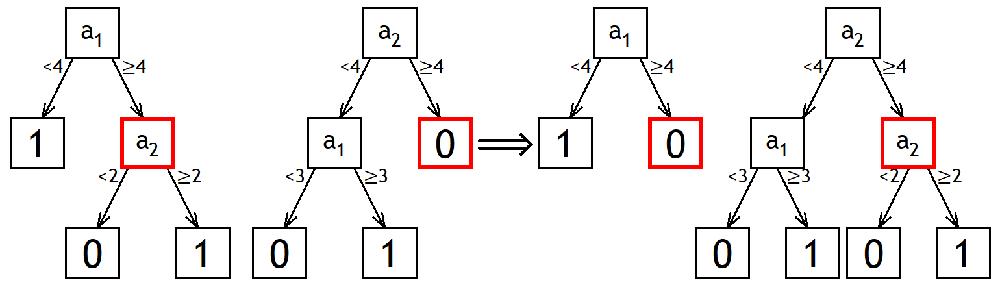
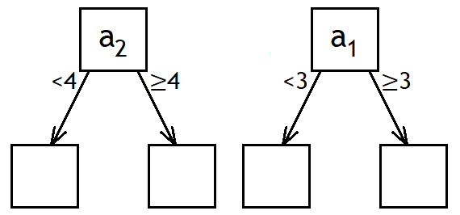
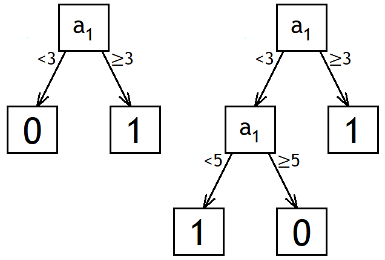
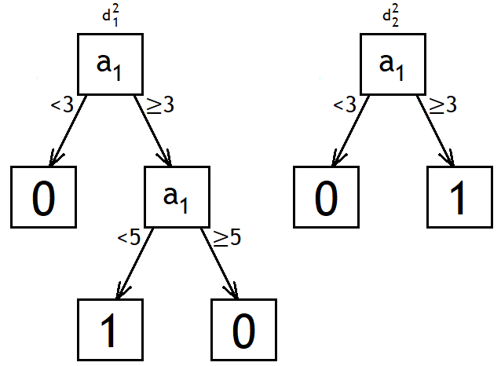
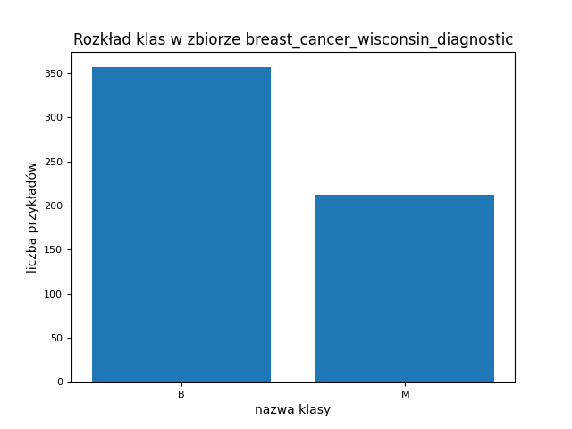

# UMA Projekt – Ewolucja drzewa
## Dokumentacja wstępna
Skład zespołu:\
Jakub Proboszcz 318713\
Paweł Kochański 318673

### 1.	Temat projektu
„Ewolucja drzewa\
Tworzenie drzewa decyzyjnego przy pomocy algorytmu ewolucyjnego. Zwykle klasyfikatory budowane są w oparciu o metodę zachłanną - w kolejnym kroku wybieramy lokalnie najlepszy podział. Takie podejście jest bardzo szybkie jednak nie zawsze prowadzi do utworzenia optymalnej struktury drzewa."

Doprecyzowanie tematu:\
Zaimplementowanie algorytmu tworzącego na podstawie danych wejściowych drzewo decyzyjne z użyciem metod typowych dla algorytmu ewolucyjnego. Algorytm ewolucyjny umożliwia eksplorację różnych konfiguracji, dążąc do znalezienia bardziej globalnie optymalnego drzewa decyzyjnego, w odróżnieniu od zachłannych metod stosowanych w zwykłych klasyfikatorach. Zbadanie efektywności powstałych drzew i porównanie ich z istniejącą implementacją algorytmu ID3.

### 2.	Algorytm ewolucji drzewa
#### Zadanie\

Algorytm ten rozwiązuje zadanie klasyfikacji - na podstawie danego zbioru przykładów i klas tych przykładów próbuje przybliżyć funkcję przyporządkowującą klasy do przykładów i umożliwić przydzielanie klas przykładom spoza zbioru danych.

Wynikiem działania algorytmu jest drzewo decyzyjne, jak najlepiej przybliżające zależność między przykładami a klasami z danego zbioru treningowego.

#### Drzewo decyzyjne\

Drzewo decyzyjne reprezentuje mechanizm decyzyjny. Jego węzły (niebędące liśćmi) odpowiadają atrybutom, a krawędzie wyborom podejmowanym na podstawie atrybutów. Liście reprezentują finalne decyzje - klasy. Przykład zaczyna od korzenia drzewa i w każdym węźle na podstawie warunku dla tego węzła wybierany jest kolejny węzeł, do którego trafi. W liściu przykładowi przydzielana jest klasa.

W używanym przez nas wariancie drzewa decyzyjnego każdemu węzłowi niebędącemu liściem przypisany jest **atrybut** $a(x)$ i **wartość graniczna** $A$. Każdy taki węzeł ma 2 dzieci - lewe jest wybierane, jeżeli (dla obecnie rozważanego przykładu $\bar{x}$) spełniony jest warunek $a(\bar{x})<A$, a prawe w przeciwnym przypadku ($a(\bar{x})\ge A$).

Każdemu liściowi przyporządkowana jest **klasa**, przydzielana przykładom które do tego liścia trafią.

Przykład:

{width=180px}

Takie drzewo jest równoważne algorytmowi:
```python
if a_1 < 4:
    return 1
else:
    if a_2 < 2:
        return 0
    else:
        return 1
```

Dla przykładu $\bar{x}=\begin{bmatrix}a_1(\bar{x}) & a_2(\bar{x})\end{bmatrix}=\begin{bmatrix}2 & 3\end{bmatrix}$ to drzewo zwróci klasę **1**.\
Dla przykładu $\bar{x}=\begin{bmatrix}a_1(\bar{x}) & a_2(\bar{x})\end{bmatrix}=\begin{bmatrix}5 & 1\end{bmatrix}$ to drzewo zwróci klasę **0**.\
Dla przykładu $\bar{x}=\begin{bmatrix}a_1(\bar{x}) & a_2(\bar{x})\end{bmatrix}=\begin{bmatrix}4 & 2\end{bmatrix}$ to drzewo zwróci klasę **1**.

#### Algorytm ewolucyjny\

Ogólny schemat algorytmu ewolucyjnego operującego na drzewach decyzyjnych (w pseudo-Pythonie):
```python
def algorytm_ewolucyjny(funkcja_oceny, rozmiar_populacji, param_zbioru_danych, param_inicjalizacji,
                        param_reprodukcji, param_operacji_genetycznych, param_sukcesji, iter_max,
                        max_wysokosc_drzewa):
  iter = 0
  populacja = inicjalizacja(rozmiar_populacji, max_wysokosc_drzewa, param_inicjalizacji,
                            param_zbioru_danych)
  oceny = [funkcja_oceny(drzewo) for drzewo in populacja]
  naj_drzewo, naj_ocena = znajdz_najlepszego(populacja, oceny)
  while not kryterium_stopu(iter, iter_max, oceny):
    reprodukcyjna_populacja = reprodukcja(populacja, oceny, rozmiar_populacji, param_reprodukcji)
    op_genetyczna_populacja = operacje_genetyczne(reprodukcyjna_populacja, param_operacji_genetycznych,
                                                  max_wysokosc_drzewa, param_zbioru_danych)
    op_genetyczne_oceny = [funkcja_oceny(drzewo) for drzewo in op_genetyczna_populacja]
    kandydat_drzewo, kandydat_ocena = znajdz_najlepszego(op_genetyczna_populacja, op_genetyczne_oceny)
    if kandydat_ocena >= naj_ocena:
      naj_ocena = kandydat_ocena
      naj_drzewo = kandydat_drzewo
    populacja, oceny = sukcesja(populacja, op_genetyczna_populacja, oceny, op_genetyczne_oceny,
                                param_sukcesji)
    iter += 1
  return naj_drzewo
```
Populacja to obecnie rozważany zbiór drzew, o stałym rozmiare określanym przez parametr ```rozmiar_populacji```.

Kryterium stopu to sprawdzenie, czy numer iteracji nie przekroczył maksymalnej liczby iteracji. Ponadto, jeżeli ```naj_ocena``` nie zmieniła się w ciągu danej liczby ostatnich iteracji, to algorytm też będzie zatrzymany.

W tym ogólnym schemacie doprecyzowania wymagają: inicjalizacja populacji, reprodukcja, operacje_genetyczne (zawierające mutację i opcjonalnie krzyżowanie), sukcesja oraz funkcja_oceny.

#### Inicjalizacja populacji\

Inicjalizacja populacji drzew wymaga konstrukcji ```rozmiar_populacji``` drzew decyzyjnych. Wygenerować jedno takie drzewo można następującym algorytmem:
```python
def inicjalizacja_drzewa(max_wysokosc_drzewa, atrybuty, klasy, prawd_liscia):
    # zwraca korzeń wygenerowanego drzewa
    return inicjalizacja_wezla(max_wysokosc_drzewa, atrybuty, klasy, prawd_liscia, glebokosc=0)

def inicjalizacja_wezla(max_wysokosc_drzewa, atrybuty, klasy, prawd_liscia, glebokosc):
    if glebokosc >= max_wysokosc_drzewa or rand() <= prawd_liscia(glebokosc):
        return Lisc(klasa=wybierz_losowy(klasy))
    else
        dziecko1 = inicjalizacja_wezla(max_wysokosc_drzewa, atrybuty, klasy, prawd_liscia, glebokosc + 1)
        dziecko2 = inicjalizacja_wezla(max_wysokosc_drzewa, atrybuty, klasy, prawd_liscia, glebokosc + 1)
        if dziecko1 jest liściem and dziecko2 jest liściem and dziecko1.klasa == dziecko2.klasa:
            dziecko2.klasa = wybierz_losowy(klasy - dziecko2.klasa)
        return Wezel(
            atrybut=wybierz_losowy(atrybuty),
            wartosc_graniczna=losuj_z(zbior_wartosci_wylosowanego_atrybutu),
            dzieci=(dziecko1, dziecko2)
        )
```
```prawd_liscia(glebokosc)``` to funkcja będąca parametrem inicjalizacji.

#### Reprodukcja\

Reprodukcja polega na wyborze ```rozmiar_populacji``` drzew (ze zwracaniem) z populacji na podstawie ich wartości funkcji oceny, żeby utworzyć nową populację, która będzie podlegać operacjom genetycznym.

Rozważamy cztery warianty reprodukcji (testowane będą wszystkie opcje):

- Proporcjonalna (ruletkowa)

Prawdopodobieństwo wyboru danego drzewa wynosi
$$
p_s(d)=\frac{funkcja\_oceny(d)}{\sum_{d'\in populacja}funkcja\_oceny(d')}
$$

Wzór ten działa dla maksymalizowanej funkcji oceny o wartościach ze zbioru $[0,\infty)$.

W następnych metodach drzewa są posortowane według funkcji oceny. Pozycja osobnika to jego ranga (najlepszy ma rangę 1).

- Rangowa

Prawdopodobieństwo wyboru danego drzewa wynosi
$$
p_s(d)=a+k(1-\frac{ranga(d)}{rozmiar\_populacji})
$$
$a$ oraz $k$ to parametry reprodukcji.\
Żeby prawdopodobieństwa sumowały się do 1, musi być spełniona zależność $\frac{n-1}{2}k+an=1$, gdzie $n$ to rozmiar populacji.

Przykładowo, dla $3$ drzew oraz $a=k=\frac{1}{4}$:\
dla najlepszego drzewa $p_s(d)=a+\frac{2}{3}k=\frac{5}{12}$\
dla środkowego drzewa $p_s(d)=a+\frac{1}{3}k=\frac{4}{12}$\
dla najgorszego drzewa $p_s(d)=a+\frac{0}{3}k=\frac{3}{12}$

- Progowa

Drzewa o jakości poniżej progu są wyrzucane. Pozostałe drzewa mają jednakową szansę na wybór.
$$
p_s(d)=
\begin{cases}
\frac{1}{\lfloor\rho\cdot rozmiar\_populacji\rfloor},\, dla\,0<ranga(d)\le\rho\cdot rozmiar\_populacji \\
0,\, w\, p.\, p.
\end{cases}
$$
$\rho\in[0,1]$ jest parametrem reprodukcji.

Przykładowo, dla $3$ drzew i progu $\rho=0{,}7$:\
dla najlepszego drzewa $p_s(d)=\frac{1}{\lfloor\rho\cdot rozmiar\_populacji\rfloor}=\frac{1}{\lfloor 0{,}7\cdot 3\rfloor}=\frac{1}{2}$\
dla środkowego drzewa $p_s(d)=\frac{1}{\lfloor\rho\cdot rozmiar\_populacji\rfloor}=\frac{1}{\lfloor 0{,}7\cdot 3\rfloor}=\frac{1}{2}$\
dla najgorszego drzewa $p_s(d)=0$
\pagebreak

- Turniejowa

Najpierw wybierana jest (ze zwracaniem) grupa drzew z całej populacji, następnie wybierane jest najlepsze drzewo z tej grupy. Rozmiar turnieju jest parametrem reprodukcji.

Przykładowo dla $3$ drzew i rozmiaru turnieju $2$:\
Jest $9$ możliwych turniejów, każdy ma równe prawdopodobieństwo wystąpienia:\
dwa razy najlepsze drzewo -> wygrywa najlepsze\
najlepsze i środkowe drzewo -> wygrywa najlepsze\
najlepsze i najgorsze drzewo -> wygrywa najlepsze\
dwa razy środkowe drzewo -> wygrywa środkowe\
środkowe i najlepsze drzewo -> wygrywa najlepsze\
środkowe i najgorsze drzewo -> wygrywa środkowe\
dwa razy najgorsze drzewo -> wygrywa najgorsze\
najgorsze i środkowe drzewo -> wygrywa środkowe\
najgorsze i najlepsze drzewo -> wygrywa najlepsze

#### Operacje genetyczne\

Na operacje genetyczne składają się mutacja i krzyżowanie, które przyjmują nietypową postać dla drzew decyzyjnych.

#### Mutacja\

Każde drzewo w populacji jest mutowane z prawdopodobieństwem, które jest parametrem mutacji.

Jeżeli zostanie podjęta decyzja, że dane drzewo jest mutowane, to wybieramy losowo jeden z jego węzłów. Jeżeli to liść, to zmieniamy jego klasę na inną, losowo wybraną. W przeciwnym przypadku, zmieniamy atrybut węzła na losowy (w szczególności atrybut może się nie zmienić). Jego wartość graniczną również losujemy ze zbioru wartości nowo wybranego atrybutu.

Może wystąpić szczególna sytuacja, gdy zmieniamy klasę liścia, którego rodzic ma dwoje dzieci-liści, na taką samą jak jego sąsiedniego liścia. Wtedy węzeł-rodzic staje się niepotrzebny - można go zastąpić liściem z klasą taką, jaką miały jego dzieci.


Dodatkowo, aby umożliwić wzrost drzewa w sytuacji bez krzyżowania rozważamy też następującą opcję mutacji:

Przy mutacji liścia (który nie jest na maksymalnej głębokości drzewa) z pewnym prawdopodobieństwem (```prawd_rozwiniecia```) zamiast zmieniać klasę „rozwijamy" go do węzła z dwójką dzieci-liści. Węzeł ten ma losowy atrybut, wartość graniczną losową ze zbioru wartości nowo wybranego atrybutu, i jego dzieci mają losowe klasy.

```prawd_rozwiniecia``` jest parametrem mutacji; równe $0$ wyłączy tę opcję.

#### Krzyżowanie\

Drzewa w populacji łączone są (losowo) w pary (np. przez przemieszanie populacji i wybranie par o indeksach (1, 2), (3, 4), itd.). Jeżeli ```rozmiar_populacji``` jest nieparzysty, pozostaje jedno drzewo - nie jest ono krzyżowane. Każda para jest krzyżowana z prawdopodobieństwem, które jest parametrem krzyżowania. Jeśli to prawdopodobieństwo jest równe $0$, to krzyżowanie jest wyłączone.

Krzyżowanie pary drzew polega na wyborze losowego węzła w każdym z drzew i zamiany ich miejscami. Powstałe dwa drzewa zastępują krzyżowaną parę w populacji wynikowej operacji genetycznych.



Może się zdarzyć, że w wyniku krzyżowania drzewo przekroczyłoby maksymalną wysokość drzewa. Wtedy takie drzewo należy odrzucić - zamiast niego wziąć jednego z rodziców (z krzyżowanej pary).

Może się zdarzyć, że w wyniku krzyżowania dwa sąsiednie liście będą miały taką samą klasę - można wtedy zastąpić węzła-rodzica liściem z klasą jego dzieci. Sytuacja ta jest analogiczna do sytuacji występującej przy zmianie klasy liścia podczas mutacji.

#### Sukcesja\

Sukcesja polega na wyborze drzew z populacji po operacjach genetycznych i z oryginalnej populacji, które wejdą w skład wynikowej populacji tej iteracji algorytmu.

Rozważamy dwa warianty sukcesji (testowane będą wszystkie opcje):

- Generacyjna

Populacja będąca wynikiem operacji genetycznych staje się nową populacją.

- Elitarna

Wybieramy ```rozmiar_elity``` drzew z oryginalnej populacji i ```rozmiar_populacji - rozmiar_elity``` drzew z populacji będącej wynikiem operacji genetycznych do utworzenia nowej populacji.

```rozmiar_elity``` jest parametrem sukcesji. Dla ```rozmiar_elity``` równego $0$ sukcesja elitarna jest równoważna generacyjnej.

#### Funkcja oceny\
Funkcją oceny używaną przez nas jest dokładność, czyli iloraz liczby przykładów ze zbioru treningowego, któremu dane drzewo przydzieliło właściwą klasę oraz liczby wszystkich przykładów w zbiorze treningowym. Funkcja ta jest **maksymalizowana**.

#### Źródło\
Algorytm w większości na podstawie\
Jankowski, D., Jackowski, K. (2014). Evolutionary Algorithm for Decision Tree Induction. In: Saeed, K., Snášel, V. (eds) Computer Information Systems and Industrial Management. CISIM 2015. Lecture Notes in Computer Science, vol 8838. Springer, Berlin, Heidelberg. [https://doi.org/10.1007/978-3-662-45237-0_4](https://doi.org/10.1007/978-3-662-45237-0_4)
\pagebreak

#### Przykładowe obliczenia algorytmu\

Przykład ten będzie przeprowadzony dla następującego zbioru danych:

 $x$   $a_1(x)$   $a_2(x)$   klasa
----- ---------- ---------- -------
  1        1          5        0
  2        1          1        0
  3        2          4        0
  4        3          3        0
  5        3          5        0
  6        4          2        1
  7        5          3        0
  8        5          1        1

oraz dla następujących hiperparametrów:\
- ```funkcja_oceny``` - dokładność na powyższym zbiorze danych\
- ```rozmiar_populacji = 2```\
- ```iter_max = 2```\
- brak zatrzymania w przypadku niezmiennej jakości najlepszego drzewa (```naj_ocena```)\
- ```max_wysokosc_drzewa = 2```\
- $prawd\_liscia(g)=\begin{cases}0\, dla\, g=0 \\ 0{,}75\, w\, p.\, p.\end{cases}$\
- reprodukcja proporcjonalna\
- prawdopodobieństwo mutacji równe $0{,}5$\
- ```prawd_rozwiniecia = 0,25``` (rozwijanie liści przy mutacji włączone)\
- prawdopodobieństwo krzyżowania równe $0{,}33$ (krzyżowanie włączone)\
- sukcesja elitarna, ```rozmiar_elity = 1```

Parametry zbioru danych:\
- atrybuty: $a_1$ o zbiorze wartości $\{1, 2, 3, 4, 5\}$, $a_2$ o zbiorze wartości $\{1, 2, 3, 4, 5\}$\
- klasy: $\{0, 1\}$

Niech $d_j^i$ oznacza $j$-te drzewo populacji z początku $i$-tej iteracji.\
Niech $m_j^i$ oznacza $j$-te drzewo zmodyfikowanej (przez reprodukcję, potem mutację, potem krzyżowanie) populacji z $i$-tej iteracji.

#### Inicjalizacja populacji\
Dla zwięzłości, inicjalizacja będzie przeprowadzona równolegle dla węzłów na tej samej głębokości w obu drzewach - kolejność wynikająca z rekurencji użytej w pseudokodzie wyżej jest inna, ale nie zmienia to wyniku ani wykonywanych czynności.\
Zaczynamy od samych korzeni.

{width=200px}

W korzeniu ```prawd_liscia(0) = 0```, zatem korzenie nie będą liśćmi. Losujemy im atrybut i wartość graniczną ze zbioru wartości wylosowanego atrybutu.

{width=350px}

W kolejnych węzłach ```prawd_liscia(1) = 0.75``` - losujemy które z tych węzłów będą liśćmi i losujemy im klasy, tak, aby w dwóch liściach będących dziećmi tego samego węzła nie było tej samej klasy.

{width=350px}

Dla węzła, który nie jest liściem, należy wylosować atrybut i wartość graniczną ze zbioru wartości tego atrybutu.

{width=450px}

Ostatni dwa rozważane węzły są na maksymalnej głębokości drzewa, zatem muszą być liśćmi. Losujemy im klasy, znów tak, aby w dwóch liściach będących dziećmi tego samego węzła nie było tej samej klasy.

{width=450px}

Otrzymaliśmy populację początkową algorytmu.

#### Iteracja 1 \

Drzewa w populacji dają następujące predykcje:

 $x$   $a_1(x)$   $a_2(x)$   klasa   $d_1^1(x)$   $d_2^1(x)$
----- ---------- ---------- ------- ------------ ------------
  1        1          5        0        1             0
  2        1          1        0        1             0
  3        2          4        0        1             0
  4        3          3        0        1             1
  5        3          5        0        1             1
  6        4          2        1        0             1
  7        5          3        0        0             1
  8        5          1        1        0             1

Oceny tych drzew są następujące:\
$funkcja\_oceny(d_1^1)=dokładność(d_1^1)=\frac{1}{8}=0{,}125$\
$funkcja\_oceny(d_2^1)=dokładność(d_2^1)=\frac{2}{8}=0{,}25$\
zatem prawdopodobieństwa ich wyboru w reprodukcji proporcjonalnej są następujące:\
$p_s(d_1^1)=\frac{0{,}125}{0{,}125+0{,}25}=\frac{1}{3}$\
$p_s(d_2^1)=\frac{0{,}25}{0{,}125+0{,}25}=\frac{2}{3}$\
Według tych prawdopodobieństw losujemy ze zwracaniem $2$ drzewa z populacji.

{width=300px}

Dla każdego z drzew po reprodukcji zachodzi mutacja z prawdopodobieństwem $0{,}5$. Jeżeli zachodzi mutacja, w mutowanym drzewie losujemy węzeł do mutacji.

{width=500px}

Wylosowano liść, zatem z prawdopodobieństwem $0{,}25$ zachodzi rozwinięcie tego liścia.

{width=500px}

Populacja po mutacji:

{width=400px}

Jest jedna para drzew. Dla niej zachodzi krzyżowanie z prawdopodobieństwem $0{,}33$.

{width=700px}

Po wymianie węzłów z ich poddrzewami jedno z drzew zawiera dwa sąsiednie liście z tą samą klasą. Po zastąpieniu ich rodzica liściem populacja wygląda następująco:

{width=400px}

Sukcesja jest elitarna, zatem do finalnej populacji musimy wybrać 1 (```rozmiar_elity```) najlepsze drzewo z populacji oryginalnej.\
Oceny tych drzew są następujące\
$funkcja\_oceny(d_1^1)=0{,}125$\
$funkcja\_oceny(d_2^1)=0{,}25$\
zatem w populacji wynikowej pierwszej iteracji znajdzie się drzewo $d_2^1$.

Poza tym bierzemy też 1 (```rozmiar_populacji - rozmiar_elity```) drzewo z populacji zmodyfikowanej $\{m_1^1,m_2^1\}$.\
Ich predykcje są następujące:

 $x$   $a_1(x)$   $a_2(x)$   klasa   $m_1^1(x)$   $m_2^1(x)$
----- ---------- ---------- ------- ------------ ------------
  1        1          5        0        0             1
  2        1          1        0        0             1
  3        2          4        0        0             1
  4        3          3        0        1             1
  5        3          5        0        1             1
  6        4          2        1        1             1
  7        5          3        0        0             1
  8        5          1        1        0             1

Oznacza to, że\
$funkcja\_oceny(m_1^1)=dokładność(m_1^1)=\frac{5}{8}=0{,}625$\
$funkcja\_oceny(m_2^1)=dokładność(m_2^1)=\frac{2}{8}=0{,}25$\
zatem do wynikowej populacji pierwszej iteracji zostanie wybrane drzewo $m_1^1$.

Otrzymujemy następującą populację początkową drugiej iteracji:\
$d_1^2:=m_1^1$\
$d_2^2:=d_2^1$\
oraz\
$funkcja\_oceny(d_1^2)=0{,}625$\
$funkcja\_oceny(d_2^2)=0{,}25$

{width=400px}

#### Iteracja 2\
Prawdopodobieństwa wyboru drzew z populacji w reprodukcji proporcjonalnej są równe\
$p_s(d_1^1)=\frac{0{,}625}{0{,}625+0{,}25}=\frac{5}{7}$\
$p_s(d_2^1)=\frac{0{,}25}{0{,}625+0{,}25}=\frac{2}{7}$\
Według tych prawdopodobieństw losujemy ze zwracaniem $2$ drzewa z populacji.

Wylosowano te same 2 drzewa - populacja nie uległa zmianie.

Dla każdego z drzew po reprodukcji zachodzi mutacja z prawdopodobieństwem $0{,}5$. Jeżeli zachodzi mutacja, w mutowanym drzewie losujemy węzeł do mutacji.

{width=400px}

W przypadku, gdy wylosowano do mutacji liść z prawdopodobieństwem $0{,}25$ zachodzi rozwijanie liścia. W tym przypadku nie zachodzi, więc zmieniamy mu klasę na inną losową (w tym przypadku jest tylko jedna inna klasa). W przypadku, gdy wylosowano węzeł niebędący liściem, losujemy mu nowy atrybut (w tym przypadku jest to ten sam atrybut co wcześniej) i losujemy nową wartość graniczną ze zbioru wartości tego atrybutu.

Populacja po mutacji:

{width=400px}

Jest jedna para drzew. Dla niej zachodzi krzyżowanie z prawdopodobieństwem $0{,}33$; w tym przypadku nie zachodzi - populacja nie ulega zmianie.

Sukcesja jest elitarna, zatem do finalnej populacji musimy wybrać 1 (```rozmiar_elity```) najlepsze drzewo z populacji oryginalnej.\
Oceny tych drzew są następujące\
$funkcja\_oceny(d_1^2)=0{,}625$\
$funkcja\_oceny(d_2^2)=0{,}25$\
zatem w populacji wynikowej drugiej iteracji znajdzie się drzewo $d_1^2$.

Poza tym bierzemy też 1 (```rozmiar_populacji - rozmiar_elity```) drzewo z populacji zmodyfikowanej $\{m_1^2,m_2^2\}$.
\pagebreak

Ich predykcje są następujące:

 $x$   $a_1(x)$   $a_2(x)$   klasa   $m_1^2(x)$   $m_2^2(x)$
----- ---------- ---------- ------- ------------ ------------
  1        1          5        0        1             0
  2        1          1        0        1             0
  3        2          4        0        1             0
  4        3          3        0        1             0
  5        3          5        0        1             0
  6        4          2        1        1             1
  7        5          3        0        0             1
  8        5          1        1        0             1

Oznacza to, że\
$funkcja\_oceny(m_1^2)=dokładność(m_1^2)=\frac{2}{8}=0{,}25$\
$funkcja\_oceny(m_2^2)=dokładność(m_2^2)=\frac{7}{8}=0{,}875$\
zatem do wynikowej populacji drugiej iteracji zostanie wybrane drzewo $m_2^2$.

Otrzymujemy następującą populację wynikową drugiej iteracji:

{width=400px}

Osiągnięto maksymalną liczbę iteracji, czyli $2$. Algorytm zwraca najlepsze napotkane w czasie jego trwania drzewo, czyli $m_2^2$ o wartości funkcji oceny równej $0{,}875$.

{width=250px}

### 3. Zbiory danych

               nazwa zbioru danych  liczba atrybutów   liczba klas   liczba przykładów
---------------------------------- ------------------ ------------- -------------------
       glass_identification               9              6             214
         dry_bean_dataset                 16             7            13611
breast_cancer_wisconsin_diagnostic        30             2             569
               wine                       13             3             178
    high_diamond_ranked_10min             38             2            9879

Zbiór danych glass_identification [[link]](http://archive.ics.uci.edu/dataset/42/glass+identification):

Przewidywanie rodzaju szkła na podstawie jego własności fizykochemicznych.

{width=500px}

 nazwa klasy liczba wystąpień
------------ ----------------
     1             70
     2             76
     3             17
     5             13
     6             9
     7             29

\pagebreak

Zbiór danych dry_bean_dataset [[link]](http://archive.ics.uci.edu/dataset/602/dry+bean+dataset):

Przewidywanie gatunku suszonej fasoli na podstawie cech zdjęcia pojedynczej fasolki.

{width=500px}

 nazwa klasy liczba wystąpień
------------ ----------------
 BARBUNYA         1322
  BOMBAY          522
   CALI           1630
 DERMASON         3546
   HOROZ          1928
   SEKER          2027
   SIRA           2636

\pagebreak

Zbiór danych breast_cancer_wisconsin_diagnostic [[link]](http://archive.ics.uci.edu/dataset/17/breast+cancer+wisconsin+diagnostic):

Diagnoza rodzaju raka piersi na podstawie właściwości komórek pobranych z piersi.

{width=400px}

 nazwa klasy liczba wystąpień
------------ ----------------
     B            357
     M            212

Zbiór danych wine [[link]](http://archive.ics.uci.edu/dataset/109/wine):

Przewidywanie rodzaju wina na podstawie jego cech fizykochemicznych.

{width=400px}

 nazwa klasy liczba wystąpień
------------ ----------------
     1             59
     2             71
     3             48

Zbiór danych high_diamond_ranked_10min [[link]](https://www.kaggle.com/datasets/bobbyscience/league-of-legends-diamond-ranked-games-10-min):

Przyporządkowanie wyników (zwycięstwo/porażka) meczy rankingowych w grze „League of Legends" na podstawie statystyk meczu pobranych w jego dziesiątej minucie trwania.

{width=500px}

 nazwa klasy liczba wystąpień
------------ ----------------
     0            4949
     1            4930

Atrybuty reprezentujące identyfikator próbki są przez nas ignorowane. Pozostałe atrybuty w tych zbiorach są numeryczne, zatem nie jest potrzebny preprocessing danych dla naszego algorytmu.

Najpierw oddzielony zostanie zbiór testowy wielkości 20% zbioru danych, wybrany losowo. Wartość dokładności na zbiorze walidacyjnym będzie wyznaczona przez 5-krotną walidację krzyżową.

Wewnątrz walidacji krzyżowej zbiór treningowy będzie służył do wyliczania funkcji oceny w algorytmie, a zbiór walidacyjny posłuży do wyboru najlepszych hiperparametrów. Ostateczne porównanie dwóch implementacji uczenia drzew decyzyjnych będzie wykonane na zbiorze testowym, dla modeli uczonych z hiperparametrami wybranymi według średniej dokładności na zbiorze walidacyjnym.

### 4. Plan eksperymentów

Główną wykorzystywaną przez nas miarą jakości będzie dokładność (accuracy). Ze względu na to, że nasz algorytm nie zwraca prawdopodobieństw (tylko konkretną klasę dla danego przykładu) oraz większość zbiorów danych ma więcej niż 2 klasy, niemożliwe jest uniwersalne stosowanie większości innych miar dla klasyfikacji.

Dla każdego hiperparametru naszego algorytmu wyznaczymy zbiór kilku wartości tego hiperparametru. Następnie uruchomimy nasz algorytm dla każdej kombinacji tych wartości 25 razy, dla różnych (ustalonych) ziaren generatora liczb losowych (125 razy jeżeli używana jest walidacja krzyżowa). Do wyboru najlepszej kombinacji hiperparametrów dla danego zbioru danych wykorzystana będzie średnia dokładność na zbiorze walidacyjnym.

Wyniki dla różnych wartości każdego hiperparametru zostaną przedstawione na wykresach typu strip plot oraz na wykresach pudełkowych.

Analogiczne strojenie hiperparametrów zostanie przeprowadzone dla implementacji klasycznego algorytmu uczenia drzew decyzyjnych:
[ID3 - hiperłącze](https://pypi.org/project/decision-tree-id3/)

Dla najlepszych kombinacji hiperparametrów, dla obu implementacji, dla każdego zbioru danych wytrenujemy po 50 modeli (dla różnych, ustalonych ziaren generatora liczb losowych) na połączonych zbiorach treningowym i walidacyjnym. Ich dokładności na zbiorach testowych zostaną wyliczone i porównane (średnie, odchylenia standardowe, najlepsze i najgorsze wyniki). Zostaną również przedstawione tabele pomyłek (confusion matrix) z uśrednionymi wynikami na zbiorach testowych dla wszystkich trzech implementacji.
